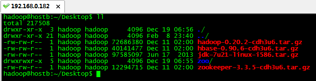

# Linux系统操作

## 认识Linux系统命令结构
【/】 :Linux文件系统的入口，也是最高一级的目录
【/bin】:基本系统所需要的命令，功能和/usr/bin类似，这个目录下的文件都是可执行的，普通用户也是可以执行的
【/boot】:内核和加载内核所需要的文件，grub系统引导管理器也在这个目录下
【/dev】:设备文件存储目录，像终端，磁盘等
【/etc】:所有的系统配置文件
【/home】:普通用户的目录默认存储目录
【/lib】:库文件和内核模块存放目录
【/media】:即插即用设备的挂载点自动存放在这个目录下，像U盘，cdrom/dvd自动挂载后，就会在这个目录下
【/mnt】:临时文件系统的挂载点目录
【/opt】:第三方软件的存放目录
【/root】:Linux超级权限用户root的跟目录
【/sbin】:基本的系统维护命令，只能由超级用户使用
【/srv】:存放一些服务器启动之后需要提取的数据
【/tmp】:临时文件目录
【/usr】:存放用户使用系统命令和应用程序等信息.像命令.帮助文件等
【/var】:存放经常变动的数据，像日志、邮件等

## 基础命令

推荐链接： https://blog.csdn.net/hezemin0315/article/details/50666803

```
1. find [path] -name fileName  查找path目录下的某个文件是否存在，输出该文件的路径

2. lsof -i:8081   查找端口8081被那个进程占用

3. kill pid \ kill -9 pid   杀掉进程\使用最高权限杀掉进程
```
### 常用命令
```
ls　　        显示文件或目录
     -l          列出文件详细信息l(list)
     -a          列出当前目录下所有文件及目录，包括隐藏的a(all)
mkdir         创建目录
     -p           创建目录，若无父目录，则创建p(parent)
cd            切换目录
touch         创建空文件
echo          创建带有内容的文件。
cat           查看文件内容
cp            拷贝
mv            移动或重命名
rm            删除文件
     -i            删除提示
     -r            递归删除，可删除子目录及文件
     -f            强制删除
find          在文件系统中搜索某文件
wc            统计文本中行数、字数、字符数
grep          在文本文件中查找某个字符串
rmdir         删除空目录
tree          树形结构显示目录，需要安装tree包
pwd           显示当前目录
ln            创建链接文件（扩展区分软连接和硬链接）
more、less    分页显示文本文件内容
head、tail    显示文件头、尾内容
ctrl+alt+F1   命令行全屏模式
```

### 系统管理命令
```
stat              显示指定文件的详细信息，比ls更详细
who               显示在线登陆用户
whoami            显示当前操作用户
hostname          显示主机名
uname             显示系统信息
top               动态显示当前耗费资源最多进程信息
ps                显示瞬间进程状态 ps -aux
du                查看目录大小 du -h /home带有单位显示目录信息
df                查看磁盘大小 df -h 带有单位显示磁盘信息
ifconfig          查看网络情况
ping              测试网络连通
netstat           显示网络状态信息
man               命令不会用了，找男人  如：man ls
clear             清屏
alias             对命令重命名 如：alias showmeit="ps -aux" ，另外解除使用unaliax showmeit
kill              杀死进程，可以先用ps 或 top命令查看进程的id，然后再用kill命令杀死进程。如果kill不掉，那就试试kill -9
```

### 打包压缩相关命令
```
gzip：
bzip2：
tar:                打包压缩
     -c              归档文件
     -x             解压文件
     -z              gzip压缩文件
     -j              bzip2压缩文件
     -v              显示压缩或解压缩过程 v(view)
     -f              使用档名
例：
tar -cvf /home/abc.tar /home/abc              只打包，不压缩
tar -zcvf /home/abc.tar.gz /home/abc        打包，并用gzip压缩
tar -jcvf /home/abc.tar.bz2 /home/abc      打包，并用bzip2压缩
当然，如果想解压缩，就直接替换上面的命令  tar -cvf  / tar -zcvf  / tar -jcvf 中的“c” 换成“x” 就可以了。
```

### 关机\重启电脑
```
shutdown
     -r             关机重启
     -h             关机不重启
     now            立刻关机
halt            关机
reboot          重启
```

### Linux管道
```
将一个命令的标准输出作为另一个命令的标准输入。也就是把几个命令组合起来使用，后一个命令除以前一个命令的结果。
eg：grep -r "close" /home/* | more       在home目录下所有文件中查找，包括close的文件，并分页输出。
```

### Linux软件包管理
dpkg (Debian Package)管理工具，软件包名以.deb后缀。这种方法适合系统不能联网的情况下。
比如安装tree命令的安装包，先将tree.deb传到Linux系统中。再使用如下命令安装。
sudo dpkg -i tree_1.5.3-1_i386.deb         安装软件
sudo dpkg -r tree                                     卸载软件
```
注：将tree.deb传到Linux系统中，有多种方式。VMwareTool，使用挂载方式；使用winSCP工具等；
APT（Advanced Packaging Tool）高级软件工具。这种方法适合系统能够连接互联网的情况。
依然以tree为例
sudo apt-get install tree                         安装tree
sudo apt-get remove tree                       卸载tree
sudo apt-get update                                 更新软件
sudo apt-get upgrade        
 
将.rpm文件转为.deb文件
.rpm为RedHat使用的软件格式。在Ubuntu下不能直接使用，所以需要转换一下。
sudo alien abc.rpm
```

### vim使用
```
vim三种模式：命令模式、插入模式、编辑模式。使用ESC或i或：来切换模式。
命令模式下：
:q                  退出
:q!                 强制退出
:wq                 保存并退出
:set number         显示行号
:set nonumber       隐藏行号
:/apache            在文档中查找apache 按n跳到下一个，shift+n上一个
:?apache           在文档中查找apache 按住n往上查找
gg                 跳转到首行
ngg                跳转到第n行行首
G                  跳转到行尾
^                  行首
$                  行尾
dd                 删除当前行
ndd                删除当前行以及往后的总计n行
yy                 复制当前行
nyy                复制当前行以及往下的n-1行
p                  粘贴
yyp                复制光标所在行，并粘贴
u                  撤销最后一个命令的更改
h(左移一个字符←)、j(下一行↓)、k(上一行↑)、l(右移一个字符→)
```

### 用户以及用户组管理
```
/etc/passwd    存储用户账号
/etc/group       存储组账号
/etc/shadow    存储用户账号的密码
/etc/gshadow  存储用户组账号的密码
useradd 用户名
userdel 用户名
adduser 用户名
groupadd 组名
groupdel 组名
passwd root     给root设置密码
su root
su - root 
/etc/profile     系统环境变量
bash_profile     用户环境变量
.bashrc              用户环境变量
su user              切换用户，加载配置文件.bashrc
su - user            切换用户，加载配置文件/etc/profile ，加载bash_profile
更改文件的用户及用户组
sudo chown [-R] owner[:group] {File|Directory}
例如：还以jdk-7u21-linux-i586.tar.gz为例。属于用户hadoop，组hadoop
要想切换此文件所属的用户及组。可以使用命令。
sudo chown root:root jdk-7u21-linux-i586.tar.gz
```

### 文件权限
```
三种基本权限
R           读         数值表示为4
W          写         数值表示为2
X           可执行  数值表示为1
```
eg:


```
如图所示，jdk-7u21-linux-i586.tar.gz文件的权限为-rw-rw-r--
-rw-rw-r--一共十个字符，分成四段。
- 第一个字符“-”表示普通文件；这个位置还可能会出现“l”链接；“d”表示目录
- 第二三四个字符“rw-”表示当前所属用户的权限。   所以用数值表示为4+2=6
- 第五六七个字符“rw-”表示当前所属组的权限。      所以用数值表示为4+2=6
- 第八九十个字符“r--”表示其他用户权限。              所以用数值表示为2
- 所以操作此文件的权限用数值表示为662 

更改权限：

- sudo chmod [u所属用户  g所属组  o其他用户  a所有用户]  [+增加权限  -减少权限]  [r  w  x]   目录名 
- 例如：有一个文件filename，权限为“-rw-r----x” ,将权限值改为"-rwxrw-r-x"，用数值表示为765
- sudo chmod u+x g+w o+r  filename
```

### 查看端口被占用
```
— netstat -apn | grep（端口号）	-n表示不进行DNS轮询，显示ip(可以加速操作)
-p 显示进程标识符和程序名称

— ps -aux | grep pid （进程号）
```

### 网络相关命令
```
- setup 
    - service iptables start     开启防火墙
    - service iptables stop      关闭防火墙
    - service iptables restart   重启防火墙
    - service network restart    重启所有的网络服务
    - service network stop       停止所有网络服务
    - service network start      开启所有网络服务
```


## 系统host

### 修改\增加配置

- sudo vim /etc/hosts

### 修改docker配置

- sudo vim /etc/docker/daemon.json

### 重启Docker配置

- sudo systemctl daemon-reload
- sudo systemctl restart docker

### Ubuntu工作区切换快捷键失效

> 解决方案：

- sudo apt-get install dconf-tools
- dconf reset -f /org/compiz/
- setsid unity
- 重启电脑，重新设置快捷键即可