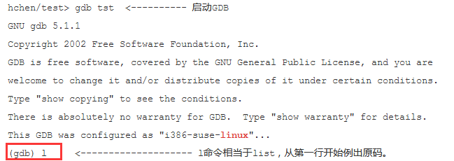
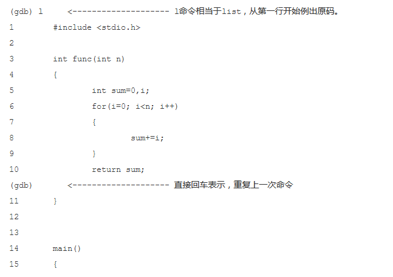
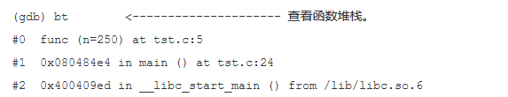
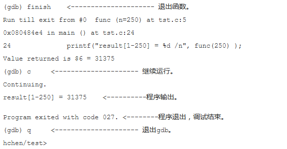

## gdb调试

> 前置条件：gdb调试的是可执行的文件，调试前，需要将源码先编译为可执行文件

#### 基本使用命令
```
- gcc -g test.c -o tst    生成可执行文件时需要有-g,有-g调试时会显示函数名和变量（而不会被内存地址所替代）。
- .gdb -help              查看gdb帮助
- .gdb tst                启动gdb调试, 可看到如下图：
```


```
- 1         相当于list,从第一行开始列出源码
- enter     回车，表示重复上一次命令
- break + 行数     设置断点，在源程序指定行数设置断点
- break + 函数名   在指定函数入口处设置断点
- info break      查看断点信息
- r               运行程序，run的简写
- n               单条语句执行， next的简写
- c               继续执行程序，continue的简写，执行下一个断点
- p + 变量名       打印变量的值，print的简写
- bt              查看函数堆栈               
- finish          退出函数
- q               退出gdb
```






> 用gdb指定你的服务程序运行时的进程id.gdb会自动attach（依附）上去并调试它。eg：gdb <program>  <PID>   ——program是我们的可执行文件；应该在PATH环境变量中搜索得到。


