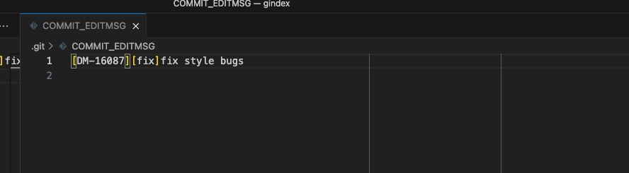

# 切出的分支pull master代码失败，并且提示分支名和message信息不一致问题

## 前置条件

项目中为了规范代码提交，使用了husky设置了代码提交规范。

git管理规范：每次开发的需求会对应有一个jira单号，开发者从master分支切一个对应的jira单号分支（例如：DM-1234-xxxxxx）；开发完成后，会降本地的DM-1234-xxxxxx push到远程分支DM-DM-1234-xxxxxx，然后在对应的project上创建一个merge request，将DM-1234-xxxxxx分支合并到master分支。

husky的配置代码如下(.husky文件)：
```js
/**
 * Define code submission rules.
 */
const fs = require('fs')
const path = require('path');
const chalk = require('chalk');
const { execSync } = require('child_process');
const msgPath = path.join('.git', 'COMMIT_EDITMSG');
const msg = fs.readFileSync(msgPath, 'utf-8').trim()
const commitRE = /^\[DM-\d{1,10}\]\[(feat|fix|docs|style|refactor|perf|test|workflow|ci|chore|types|demo|script)\].+/

console.log('msgPath:', msgPath);
console.log('msg:', msg);

if (!commitRE.test(msg) && !(/(Merge Branch|Revert|i18n)/i.test(msg))  ) {
  console.error(
    `  ${chalk.bgRed.white(' ERROR ')} ${chalk.red(`invalid commit message format.`)}\n\n` +
    chalk.red(`  Proper commit message format is required for automated changelog generation. Examples:\n\n`) +
    `    ${chalk.green(`[DM-12345][fix]: add 'comments' option`)}\n` +
    `    ${chalk.green(`[DM-12345][feat]: handle events on blur (close #28)`)}\n\n` +
    `${chalk.green(`  valid commit message pres are: feat|fix|docs|style|refactor|perf|test|workflow|ci|chore|types|demo|script`)}\n\n` +
    chalk.red(`  See .github/COMMIT_CONVENTION.md for more details.\n`)
  )
  process.exit(1)
}

const currentBranch = execSync('git rev-parse --abbrev-ref HEAD').toString().trim();
const branchRE = /DM-\d{1,10}/;
const branchMatch = currentBranch.match(branchRE);
const commitMatch = msg.match(branchRE);

console.log('currentBranch:', currentBranch);
console.log('branchMatch:', branchMatch);
console.log('commitMatch:', commitMatch);

if (branchMatch && commitMatch && branchMatch[0] !== commitMatch[0]) {
  console.error(
    `  ${chalk.bgRed.white(' ERROR ')} ${chalk.red(`branch name and commit message DM-XXXXX do not match.`)}\n\n` +
    chalk.red(`  Branch name: ${currentBranch}\n`) +
    chalk.red(`  Commit message: ${msg}\n`) +
    chalk.red(`  Please ensure they match.`)
  );
  process.exit(1);
}
```

## 问题

### 问题描述

在开发过程中，开发者在本地开发完成后，push到远程分支DM-1234-xxxxxx，随后自测发现存在bug,在DM-1234-xxxxxx分支上修复这个bug需要后端配合，且在等待后端完成的时候，此时来了一个紧急新需求jira单号666，此时开发者讲代码add操作后，进行了commit操作，没有push代码到远程分支；随后开发者checkout到master,另外切了一个分支DM-666-xxxxxx；开发者在DM-666-xxxxxx上面完成需求后，又出现了等待后端联调的情况；此时1234的需求后端已经完成，随后开发者保存666的代码，且push到远程666分支；紧接着回到了1234分支，完成bug的修复，并push了1234的代码，且在远程发起了merge reuqest操作。此时的master已经merge了其他开发者的代码到master，所以master的代码比666的代码提前好几个commit;为了避免到时候合并代码到master的时候出现冲突问题，开发者在666分支执行git pull originl master操作时，出现了报错，具体报错信息如下：


检查.git/COMMIT_EDITMSG文件;文件内容如下：




### 问题定位

直接使用node运行husky的配置

得到输出结果：
```bash
$ node verify-commit-msg.js 

msgPath: .git/COMMIT_EDITMSG
msg: [DM-16087][fix]fix style bugs
currentBranch: master
branchMatch: null
commitMatch: [
  'DM-16087',
  index: 1,
  input: '[DM-16087][fix]fix style bugs',
  groups: undefined
]
```

==疑是husky的校验逻辑有问题==