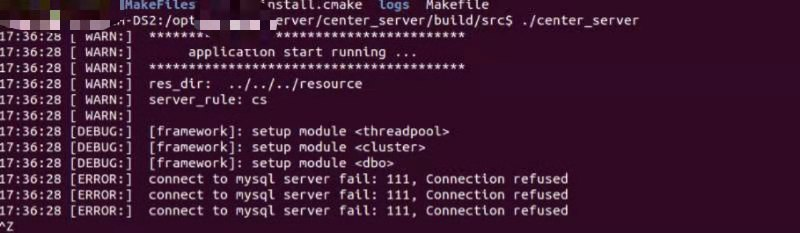
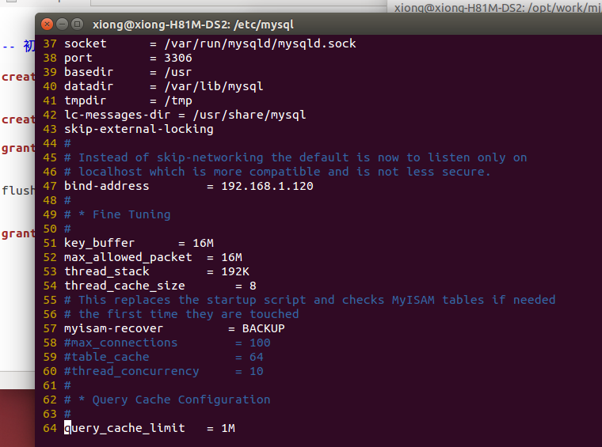
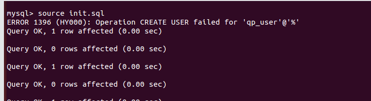
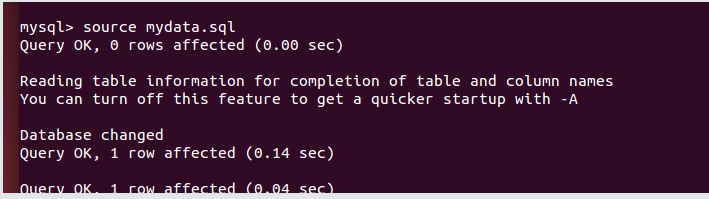
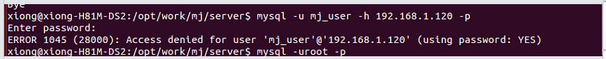
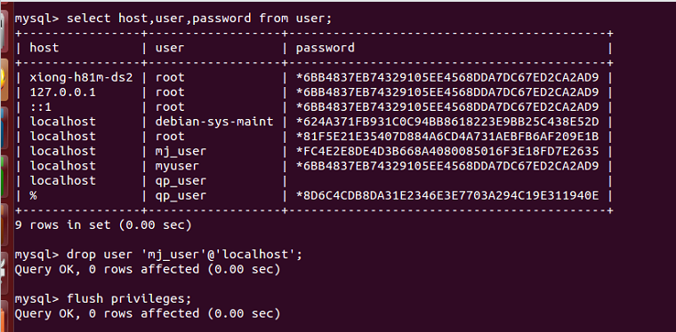
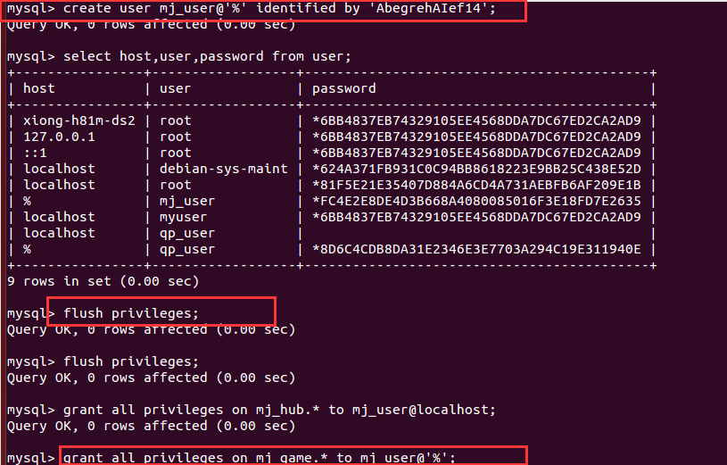
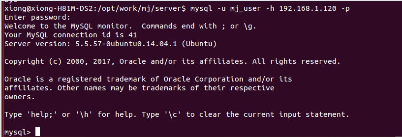

## 报错汇总

#### 启动项目（棋牌）—— center-server启动时bind端口失败（数据库拒绝连接请求）

##### 错误提示：


##### 分析：
```
1. 检查数据库是否启动了；
2. 检查连接数据库的脚本文件是否访问对了——“用户名”，“密码”， “端口号”，“ip号”等等
3. 如果都对了，那么需要查看数据库的问题：
  ~ 用户名是否创建成功？执行：select user from mysql.user; —— 查看用户。
  ~ 用户创建成功，用户是否有操作权限？ show grant for 你的用户 —— 例如：show grants for 用户名@localhost
  ~ 查看用户配置里面绑定的ip和我连接时候脚本是否一致，查看配置文件到目录： /etc/mysql/my.cnf
```



```
这里绑定的是192.168.1.120；
~ 在命令行测试是否能连接数据库可以使用：mysql -u 用户名 -h 'host' -p 密码。 例如：
mysql -u 用户名 -h 192.168.1.120 -p。
~ 如果这些步骤都成功，那么数据库链接则可以成功了。
```


#### 不小心直接在mysql.user表里面删除了（delete）了"用户"

- 直接删除mysql里面的user表里面的用户，这种操作是非常严重的错误，违规操作。
- 正确的删除用户操作：drop use 用户名 —— 例如：drop user 用户名@127.0.0.1
- 重新创建常规用户：create use 用户名；例如： create user 用户名@127.0.0.1

~ 如果是删除了root用户。那么可以参考以下文章内容解决这个问题：http://blog.csdn.net/u012802020/article/details/60468056
```
链接中的一个步骤就是在my.cnf配置文件里面添加--skip-grant-tables
这一个语句会使得登录的用户跳过验证，在恢复了root用户之后就应该把这一个语句删除掉。
```


#### 用户已存在错误（1396）：
- 执行：create user 用户名@'%' identified by 密码

错误信息：


解决方法：
```
- 进入数据库，一次执行：
- user mysql 
- drop user 用户名@'%'
- flush privileges
- 重新执行需要执行的语句，解决这个问题
```

#### 数据库预读问题（执行use dbname出错）
使用数据库时出错：


解决办法：
```
推荐链接： blog.csdn.net/u012599988/article/details/51922100

- 进入数据库的时候执行：mysql -u username -p -A；
- 这里-A就是不再预读数据库；
- 造成错误原因：数据库中的表太多，预读数据量过大。
```


#### 1045错误：


原因分析：
```
- 创建用户的时候使用的是create user 用户名@localhost identifyed by 密码；
- 创建的时候使用的是localhost,如果把创建时的localhost改为'%'即可解决这个问题。
```
1. 删除原来的用户


2. 重新创建用户，给用户授权数据库操作


3. 连接登录数据库



