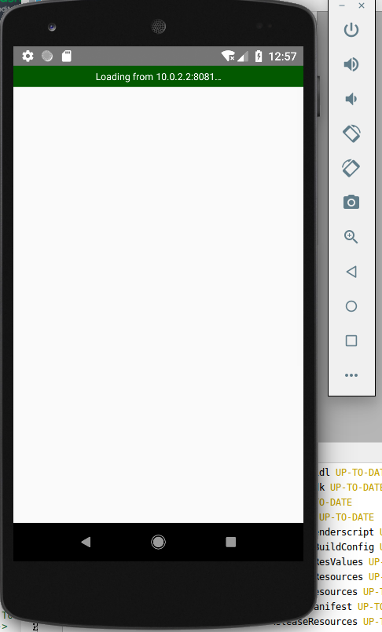
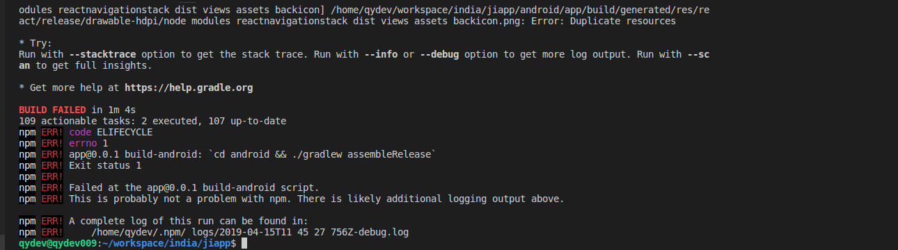
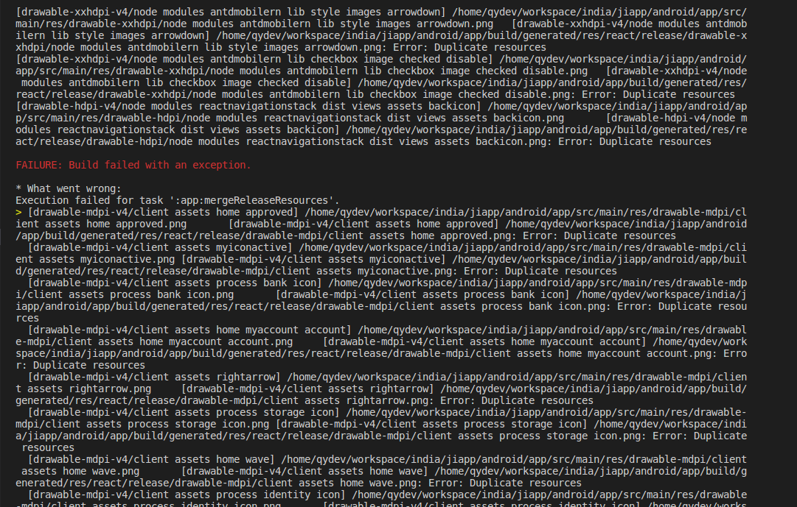

# 环境

## 安装react-native基础环境

### linux环境

#### 安装所需的运行环境
```
1. node环境   
- 版本要求：8.3版本以上，高于8.3
2. Python2
- 版本要求，必须为2.x（不支持3.x）
3. JDK环境
- 版本要求：必须为1.8（不支持1.9以及更高版本）
4. React-native命令行工具
- 即react-native-cli 脚手架
5. Android-Studio
- 主要是SDK的安装，SDK必须要全面，否则的话会出现莫名其妙的问题，启动不起来。
```

#### 需要的环境

-1. node环境,node版本必须高于8.3

以下是源码编译安装过程:

- node官网下载安装包  https://nodejs.org/zh-cn/ 
- 解压: tar -zxvf 安装包名
- ./config
- make
- make install
- cp /usr/local/bin/node /usr/sbin
- 检测是否安装成功: node -v

此过程中可能出现没有权限安装的情况,可以sudo一下.

-2. 安装react-native-cli 命令行工具(yarn可装可不装,看个人喜欢)

 - npm install -g yarn react-native-cli
 - 检查安装: react-native -v

-3. 安装JDK, JDK必须安装1.8版本(暂不支持1.9及更高版本)

 - 官网下载安装包(根据自己电脑环境下载相应的安装包): https://www.oracle.com/technetwork/java/javase/downloads/jdk8-downloads-2133151.html 
 - 解压安装包: tar -zxvf 安装包名
 - 创建一个目录来安装jdk: mkdir /usr/java
 - 拷贝解压后内容到新建目录下: mv 解压后的安装包路径 拷贝至的目标路径(这里是:/usr/java)
 - 修改环境变量: vim /etc/profile
  将以下内容拷贝到: /etc/profile 文件中

  ```
    export JAVA_HOME=/usr/java/解压的安装包名
    export JRE_HOME=${JAVA_HOME}/jre
    export CLASSPATH=.:${JAVA_HOME}/lib:${JRE_HOME}/lib:$CLASSPATH
    export JAVA_PATH=${JAVA_HOME}/bin:${JRE_HOME}/bin
    export PATH=$PATH:${JAVA_PATH}
  ```

 - 编辑完成后保存退出
 - 配置完成后,需要让配置文件生效: a. source /etc/profile 即相当于执行一下配置文件; b. 重启一次电脑

 - 检测是否安装成功: javac -version

 在安装过程中我们可能需要一个root权限.可以sudo一下.

-4. 安装Android Studio开发工具

 - 官网下载安装包: https://developer.android.google.cn/studio/#downloads 
 - 解压安装包:tar -axvf 安装包名字,也可以直接双加安装包,提取
 - cd 解压后的安装包/bin
 - 执行安装程序: ./studio.sh
 - 之后步骤与windows上面的类似,可以先不设置代理,默认先安装开发软件
  
-5. 设置android studio的代理服务器

 - 打开网: http://tool.chinaz.com/
 - 选择网站测试分类
 - 输入: dl.google.com
 - 选中ping检测
 - 获得检测结果,拉下去看列表,找到一个速度最快且是国内的ip,自己电脑控制台可以ping通的ip
 - 配置电脑上面的hosts:
 - sudo vim /etc/hosts
 - 在最后一行加上:
 能ping通的ip host 例如:
 203.208.41.41 dl.google.com
 - 修改完成后,保存退出: wq
 - 打开android studio,选择 Config -> SDK Manager -> HTTP Proxy -> 选择第一项:No Proxy
 - 之后就可以在Android SDK中选择自己需要的SDK版本加载,加载完成后,既可以自己创建一个项目试一下.

-6. 安装Watchman

 - git clone https://github.com/facebook/watchman.git
 - cd watchman
 - git checkout v4.5.0
 - ./autogen.sh
 - ./configure
 - make
 - sudo make install

   执行./autogen.sh的时候可能会报错,提示找不到命令

    ```
    ./autogen.sh: 9: ./autogen.sh: aclocal: not found
    ./autogen.sh: 10: ./autogen.sh: autoheader: not found
    ./autogen.sh: 11: ./autogen.sh: automake: not found
    ./autogen.sh: 12: ./autogen.sh: autoconf: not found
    ```

   解决办法:
   执行: sudo apt-get install autoconf 安装autoconf命令即可解决

   如果上面的步骤都没问题,那么即可完成Watchman的安装
  

-7. 创建AVD虚拟设备

 - 利用脚手架新创建一个空的react-native工程: reac-native init helloReactNative
 - 打开Android Studio开发工具,打开刚刚创建的工程,点击右上角的小手机图标,新创建一个AVD
 - 此时可能会提示你安装KVM

-8. 安装HAXM
    - 当创建小手机的时候提示/dev/kvm not found错误.
    - 错误原因:没有正确安装kvm
    - 我们需要重启电脑,在重启电脑过程中按 'esc'键,选择System setting 进入到bios
    - 进入bios后,我们找到cpu configure
    - 随后,找到Virtualization Technology(VT),状态由Disable改为Enable
    - 按F10保存退出bios设置
    - 电脑重启后,打开终端,输入: sudo apt-get install qemu-kvm
    - 安装完成后, 输入: sudo kvm-ok 检测安装是否正确

    > 检查kvm
    - 检查处理器是否支持硬件虚拟化: $ egrep -c '(vmx|svm)' /proc/cpuinfo  如果输出为0则表示不支持硬件虚拟化
    - 如果支持安装CPU检查器: $ sudo apt-get install cpu-checker
    - 安装完成后,就可以检查kvm的安装了: $ sudo kvm-ok
    如果我们看到输出:
    "INFO: Your CPU supports KVM extensions
    KVM acceleration can be used"
    则说明kvm安装成功.可以使用了

    此时,启动小手机的时候将不会再提示: /dev/kvm not found

-9. 启动项目
    - 执行: react-native run-android

    此时可能出现的报错:

    -1> 出现找不到文件的情况

    ```
    java.io.IOException: Cannot run program "/home/qydev/software/work/SDK/build-tools/23.0.1/aapt": error=2, 没有那个文件或目录
            at java.lang.ProcessBuilder.start(ProcessBuilder.java:1048)
            at com.android.builder.png.AaptProcess$Builder.start(AaptProcess.java:167)
            at com.android.builder.png.QueuedCruncher$1.creation(QueuedCruncher.java:118)
            at com.android.builder.tasks.WorkQueue.run(WorkQueue.java:203)
            at java.lang.Thread.run(Thread.java:748)
    Caused by: java.io.IOException: error=2, 没有那个文件或目录
            at java.lang.UNIXProcess.forkAndExec(Native Method)
            at java.lang.UNIXProcess.<init>(UNIXProcess.java:247)
            at java.lang.ProcessImpl.start(ProcessImpl.java:134)
            at java.lang.ProcessBuilder.start(ProcessBuilder.java:1029)
            ... 4 more
    ```

    分析原因:
        - 可能缺少C++相关的依赖库造成的,需要安装依赖库
        - 64位系统缺少32位的相关依赖库
    解决办法:
        - 执行一下,安装依赖库: $sudo apt-get install lib32z1 lib32ncurses5 lib32bz2-1.0 lib32stdc++6
        - 执行一下,安装依赖库: sudo apt-get install -y libc6-i386 lib32stdc++6 lib32gcc1 lib32ncurses5 lib32z1
    
    
    -2> emulator错误,SDK出现问题
    BUILD FAILED
    
    Total time: 4.96 secs
    Could not install the app on the device, read the error above for details.
    Make sure you have an Android emulator running or a device connected and have
    set up your Android development environment:
    https://facebook.github.io/react-native/docs/getting-started.html
    
    解决办法:
    - 安装adb: sudo apt-get install android-tools-adb
    - 检测device: adb devices
        如果此时终端输出如下内容:则表示成功:
        List of devices attached
        emulator-5554	
        
        否则输出:
        List of devices attached
        emulator-5554	unauthorized
        这种情况表示不成功,解决办法:
        - 执行一下: adb kill-server
        - 再执行一下: adb start-server
        
        重新检测,看是否能够正确输出.如果能,则可以开始重新启动程序


    4> 启动时控制台提示:
    - 错误信息: 
        List of devices attached
        adb server version (**） doesn't match this client (**)
        * daemon started successfully
    
    - adb版本不匹配
    - 解决办法: 
        - 找到我们的SDK安装目录
        - 进入platform-tools/ 拷贝该目录下的可执行文件到用户系统回去自己查找的全局路径位置;
            这里我放在: /usr/local/var/lib/android-sdk/platform-tools/adb
            命令: sudo cp  adb /usr/local/var/lib/android-sdk/platform-tools
    

    5> 小手机可能报错:
        - 错误信息:
        Could not connect to development server
        小手机大红屏,小手机上面的错误信息:
            翻译：
                -连接不到开发的服务器。
                
                -请按照以下的步骤来修复此问题：
                
                -确保包服务器在运行
                -确保你的设备或者模拟器连接着电脑，并且手机打开了USB调试模式，然后在cmd中运行adb devices来查看已经连接好的设备列表
                - 确保飞行模式是关闭的
                - 如果是使用真机来开发，输入 adb reverse tcp:8081 tcp:8081来检查设备
                - 输入IP：8081（这个大家都会）
        
        
        参考链接: https://www.cnblogs.com/lanzhi/p/6467244.html
        
        - a> 检查包服务:
            在浏览器直接访问:http://localhost:8081  如果页面不报错,但一直在转圈圈,没有任何反应,
            
            分析: 
            可能是node安装问题,重新安装一下最新版的node(推荐安长期维护版本的node)
            - 下载: 源码安装包
            - 
            
            
        - b> 检查硬件连接，以及使用adb devices来查看是否连接成功。
        - c> 飞行模式关闭
        - d> 在cmd中输入 adb reverse tcp:8081 tcp:8081, 如果报错,开启小手机,且重启一下devices,再执行这个命令
        
        
    6> 小手机中程序能启动了,但是卡在进入页面,如下:
    
    
    - 按住 'Alt + m' 键,选择 'dev setting' -> 点击'Debug' -> 设置服务器主机和端口号: '8081'
    
    - 可以reload一下, 按住 'Alt + m' 键, 选择reload
    - 关机重启手机,设置为允许USB连接,以及开启开发者模式

---

#### react-native从版本0.55升级到0.58出现的不能打包问题

##### 项目环境：使用了typescript编写代码

- 提示的错误信息:



- 具体错误信息:



- 错误分析：

> 根据提示信息，提示图片资源重复，打开android/app/src/main/res/drawable-* 开头的文件下面全部都重复了，图片文件重复原因，在打包前bundle代码，造成图片重复打包。bundle执行的指令如下：
react-native bundle --platform android --dev false --entry-file index.js  --bundle-output android/app/src/main/assets/index.android.bundle  --assets-dest android/app/src/main/res/

- 解决办法：
>==我们可以在打release包前，将这几个文件夹中的文件删除，但是需要保留启动页的图片。在重新执行：==
```
1. cd android
2. ./gradlew assembleRelease

打release包
```

- 如果需要打的包是debuger包，则需要bundle之后再打包。

---

#### 执行react-native run-android 手机模拟器报500错误，链接不到服务

##### 解决办法：

```
- 执行 react-native start --reset-cache 清除缓存，启动服务
- 重启项目 react-native run-android
```

---

## 红米手机react-native run-android出错，用户取消安装

### 错误内容：

```
- react-native run-android
提示： 用户取消安装
```

### 分析问题\解决过程记录：

```
- 检查手机是否连接好数据线
- 检查手机是否开启USB调试
- 检查手机是否允许USB传输文件
- 检查手机是否开启开发者模式
- 以上都确保没问题的时候，重新执行react-native run-android
- 依旧报错，检查开发者模式中的设置， 发现`USB安装`没有打开
- 点击打开`USB安装`，提示需要登录小米账号
- 登录小米账号后，再次去开启`USB安装`，提示需要插入SIM卡，根据提示插入SIM卡
- 重启rn
- 报错提示：adb no permission
- 猜测估计adb服务不对，尝试重启adb
- adb kill-server
- adb start-server
- 重启rn,红米手机成功安装App
- 问题解决
```


