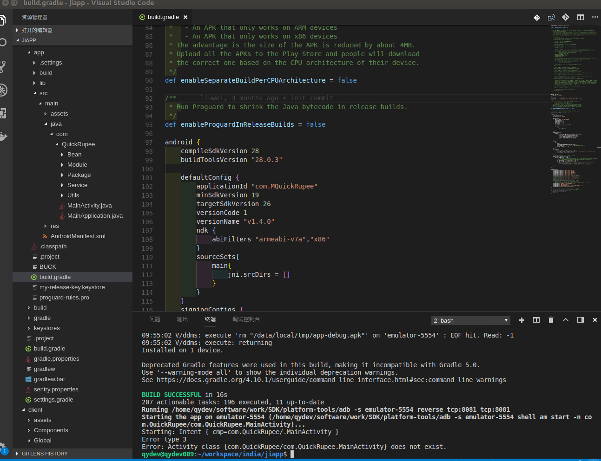

# 修改apk包的包名

## Android修改Apk包名

### 需要修改的位置：

```
主要修改的位置：
> java文件：
- android/app/src/main/java/com/PROJECT_NAME/MainActivity.java
- android/app/src/main/java/com/PROJECT_NAME/MainApplication.java
- 其他涉及到包的引用的地方

> 安卓描述文件：android/app/src/main/AndroidManifest.xml文件中的package="com.oc.newobjective"

> 打包脚本：android/app/BUCK
android_build_config(
    ...
    package = "com.oc.newobjective",
)

android_resource(
    ...
    package = "com.oc.newobjective",
    ...
)

> android/app/build.gradle:
defaultConfig {
    applicationId "com.oc.objective"
    ...
}

```

### 实际操作步骤：

- 在vscode中先修改android/app/build.gradle
- 在修改android/app/src/main/AndroidManifest.xml
- 修改android/app/BUCK为新包名
- 将项目用Android Studio打开
- 在android/app/src/main/com/包名 修改为 在android/app/src/main/com/新包名
- 重启项目，执行成功

### 修改包名出现的bug

#### 报错信息出现场景

当我只修改android/app/build.gradle文件中的applicationId为新包名时，出现如下错误信息。

#### 具体报错信息如下

```
Starting the app (/home/xxx/soft/sdk//platform-tools/adb shell am start -n xxx/.MainActivity)…
Starting: Intent { cmp=xxx/.MainActivity }
Error type 3
Error: Activity class {xxx/xxx.MainActivity} does not exist.
```


#### 报错原因：

出现这个问题的原因是我们的package和applicationId不一致。如果你没有在你的 build.gradle 文件中定义 applicationId，这个applicationId 将默认为 AndroidManifest.xml 中所指定的与package相同的值。

#### 解决办法：
替换项目中所有使用到旧包名的地方都替换成新的包名，即可解决。


