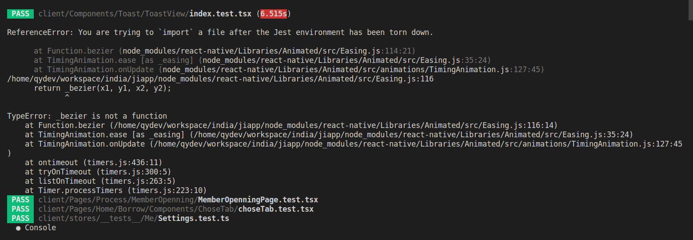
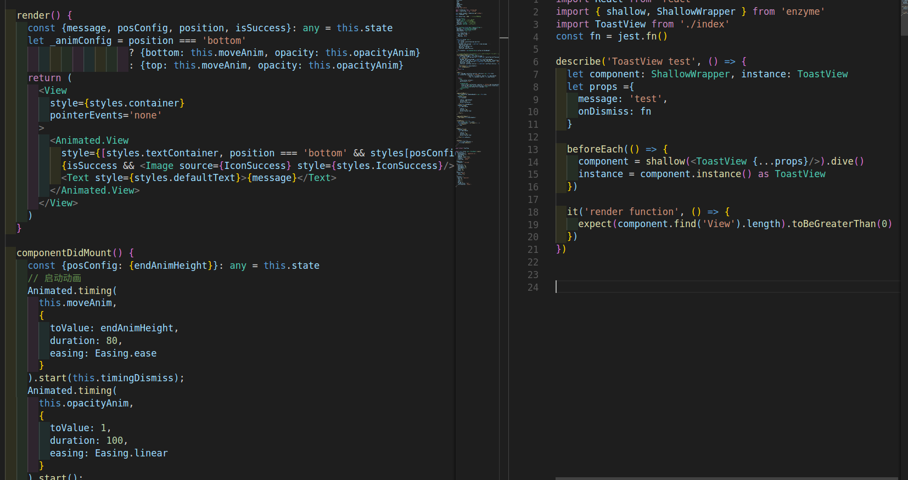

## 单元测bug汇总

### jest和enzyme结合

#### Page单元测试

##### 测试代码跑不过，错误提示在jest代码跑完之后试图import一个文件

###### 错误信息如下：


###### 关键代码：


###### 分析\解决问题：
> 根据错误信息提示：我的测试先跑完了，确试图去import一个文件。
> 拿错误信息去百度：获得解决办法提示 —— jest.useFakeTimers();
> 去jest官网搜索jest.useFakeTimers(),找到问题，代码中使用了定时器；
> 定位问题：代码中使用了定时器，但是没用使用定时器的方式去解决问题。
> 根据官网提供的例子，解决错误。
###### 最终的测试代码如下：

```
import React from 'react'
import { shallow, ShallowWrapper } from 'enzyme'
import ToastView from './index'
const fn = jest.fn()

jest.useFakeTimers();

describe('ToastView test', () => {
  let component: ShallowWrapper, instance: ToastView
  let props ={
    message: 'test',
    time: 2000,
    onDismiss: fn
  }

  beforeEach(() => {
    component = shallow(<ToastView {...props}/>)
    instance = component.instance() as ToastView
  })

  it('render function', () => {
    expect(component.find('View').length).toBeGreaterThan(0)
  })

  it('timingDismiss function', () => {
    instance.timingDismiss()
    expect(setTimeout).toHaveBeenLastCalledWith(expect.any(Function), 2000);
  })
})
```


