# react18+jest单元测试分享

## 目录页

<b> [单元测试的核心概念](#为什么需要单元测试？) </b>
<b> [为什么需要单元测试？](#单元测试的核心概念)</b>
<b> [前端单元测试工具链](#前端单元测试工具链) </b>
<b> [编写高质量测试的实践](#编写高质量测试的实践) </b>
<b> [常见问题与调试技巧](#常见问题与调试技巧) </b>
<b> [单元测试与持续集成](#单元测试与持续集成) </b>
<b> [总结与资源](#总结与资源) </b>

## 详细内容

### 为什么需要单元测试？

针对当前的观察到的现象

1. 改一行代码,出现多个bug;
2. 祖传代码不敢轻易改，牵一发而动全身，容易出现拆东墙补西墙的情况；

单元测试的价值

✅ 快速反馈，减少调试时间（如果每个单元mock了，确保逻辑正确，能够减少调试过程中前端的出错概率）

✅ 提升代码可维护性（鼓励模块化设计）

✅ 保障重构安全性

✅ 作为“活文档”描述代码行为（体现在单测用例的描述中）


### 单元测试的核心概念

<b>测试分类：</b>单元测试、集成测试、E2E测试；

==单元测试是对代码最小单位的独立验证；==

<b>代码最小单位:</b> 函数、组件（最小单位的组件，如果组件中包括一些子组件，则应该归类为集成测试）；

<b>单元测试的主要组成部分</b>

- 模拟数据 (mock)
- 测试套件（descript）
- 测试用例 (it/test)
- 断言 (expect)
- 测试报告 (report)

eg:
```js
function add(a, b) {
  return a + b;
}
```

```js
// 第一个参数用来描述该测试用例的测试部分；
test('adds 1 + 2 to equal 3', () => {  
  // Arrange  
  const a = 1, b = 2;  
  // Act  
  const result = add(a, b);  
  // Assert  
  expect(result).toBe(3);  
});  
```

在单测足够简单的情况下，可以不使用测试套件（descript);多个测试用例可以作为一个测试套件,测试套件可以嵌套测试套件；测试套件的第一个参数同样可以描述测试套件。

==无论是单元测试、集成测试还是E2E测试，必须具备确定性。（即必须保障一个完整的单元测试中必须要有断言）；一个不确定的单元测试是没有意义的==

### 前端单元测试工具链
主流工具对比

| 工具            | 适用场景          | 特点                   |
| --------------- | ----------------- | ---------------------- |
| Jest            | 通用测试框架      | 零配置、快照测试       |
| Testing Library | React/Vue组件测试 | 贴近用户交互的测试     |
| Cypress         | 组件测试/E2E      | 可视化调试             |
| Vitest          | Vite项目测试      | 超快速度、兼容Vite生态 |
		
		
工具链组合推荐

React项目：Jest + React Testing Library + MSW（Mock API）

Vue项目：Vitest + Vue Test Utils + Testing Library

### 编写高质量测试的实践

#### 一些基本原则和技巧

<b>测试的FIST原则</b>

- Fast（快速）：测试应秒级完成，避免开发者因等待而减少执行频率。
- Isolated（隔离）：每个测试用例独立运行，不依赖其他测试的状态。
- Repeatable（可重复）：在任何环境（本地、CI）中结果一致。
- Self-Validating（自验证）：测试结果应为明确的通过/失败，无需人工判断。
- Timely（及时）：测试代码与生产代码同步编写（TDD更佳）。

<b>明确测试目标，应遵循以下原则：</b>

*测试代码应像生产代码一样认真维护*。

*测试的目的是发现Bug，而不是证明代码能运行*。

==单元测试应当覆盖每一个switch、if..else、|| 、&&等运算过程中的每个场景。通过mock对应的场景来覆盖。==

<b>编写可读性高的单元测试</b>

可读性高，需要在测试套件和测试用例的描述中，对该测试做详细的说明 —— 应当写明什么场景，产生什么结果。

<b>测试边界和异常</b>

- 验证正常输入输出；
- 验证边界：1. 空值（null/undefined/''等）；2. 极端值（数字益出、超长字符串、空字符等等）；3.错误的权限/非法操作（传入非法的数据类型等）；
- 异常：确保错误消息能够被正确捕获。

<b>避免常见的陷阱</b>

- 覆盖率陷阱：追求有意义的覆盖率（如100%行覆盖 ≠ 无Bug），关键逻辑需重点覆盖。
- 过度mock: mock的数据时，应当重点mock外部依赖；
- 过度细节测试：避免断言结果过度依赖于细节（如UI结构），应该重点基于用户行为测试。

<b>示例：</b>

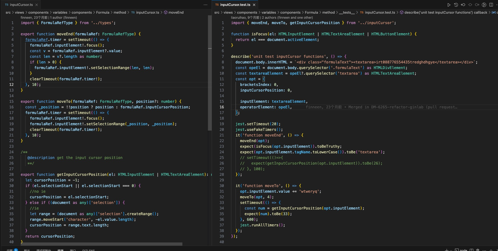

问题点：

- 测试目标不明确；
- 测试用例可读性低 —— 测试用例没有具体描述：在什么条件下得到什么结果；
- 测试边界不清晰；
- 过度mock;

*纠正后的单元测试代码请参考：src/views/components/variables/components/Formula/method/\_\_tests\_\_/inputCursor.test.ts*

#### 函数测试

单元测试中函数的测试比较简单，单个函数也是单元测试的最小测试单位；测试用例覆盖场景应该全面，尤其侧重对极限值做测试。

##### 包含定时器的函数单元测试

*单元测试的测试用例中，不要使用setTimeout去等待断言，可以使用虚拟定时器jest.useFakeTimers解决定时器问题*

* 示例
  
```ts
// 待测函数
import { FormulaRefType } from '../types';

export function moveEnd(formulaRef: FormulaRefType) {
  formulaRef.timer = setTimeout(() => {
    formulaRef.inputElement!.focus();
    const v = formulaRef.inputElement?.value;
    const len = v?.length as number;
    if (len > 0) {
      formulaRef.inputElement!.setSelectionRange(len, len);
    }
    clearTimeout(formulaRef.timer!);
  }, 10);
}
```

```ts
// 测试代码
import { FormulaRefType } from '../../types';
import { moveEnd, moveTo, getInputCursorPosition } from '../inputCursor';

describe('moveEnd', () => {
  let mockFormulaRef: FormulaRefType;
  let mockInputElement: HTMLTextAreaElement;
  
  beforeEach(() => {
    // ceate mock dom
    mockInputElement = {
      value: '',
      focus: jest.fn(),
      setSelectionRange: jest.fn(),
      selectionStart: 0,
      selectionEnd: 0,
    } as unknown as HTMLTextAreaElement;
    
    // create mock formulaRef
    mockFormulaRef = {
      inputElement: mockInputElement,
      timer: null,
    } as unknown as FormulaRefType;
    
    // clear all mock messages.
    jest.clearAllMocks();
    // 使用虚拟定时器；
    jest.useFakeTimers();
    // 给timeout打桩 —— 保留clearTimeout和setTimeout的实际功能，但是使其能够被断言；
    jest.spyOn(global, 'clearTimeout');
    jest.spyOn(global, 'setTimeout');
  });

  // 描述测试用例具体测试什么内容
  it('should focus input and set cursor to end when text exists', () => {
    mockInputElement.value = 'test value';
    
    moveEnd(mockFormulaRef);
    jest.advanceTimersByTime(20); // 定时器快进20毫秒后；避免影响单元测试执行速度
    
    // clearTimeout被调用
    expect(clearTimeout).toBeCalledWith(mockFormulaRef.timer);
    // 断言聚焦函数被执行
    expect(mockInputElement.focus).toHaveBeenCalledTimes(1);
    // 断言光标会移动到最末尾的位置
    expect(mockInputElement.setSelectionRange).toHaveBeenCalledWith(10, 10);
  });

  afterEach(() => {
    jest.useRealTimers(); // 恢复成真实的定时器
  });
});

```

#### 组件测试

测试组件的时候，尽量不要使用querySelector去找元素（迫不得已时才可用，即使使用，也不要出现选择具体第几个元素这种操作。）

⚠️ 为什么不推荐 querySelector？
- 易受 DOM 结构变化影响（如 CSS 类名或标签变化）—— 违背了单元测试的FIST原则；
- 违背 Testing Library 的[用户视角测试原则](https://testing-library.com/docs/guiding-principles/)
- 缺乏可读性（无法直观看出查询目标）

例如以下的单元测试：

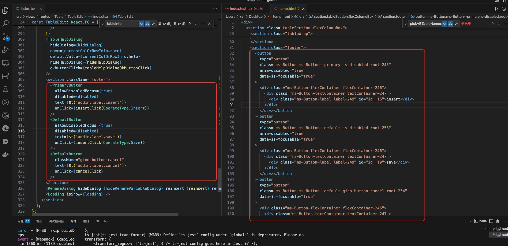

假设我当前想要断言第二个save按钮是否是禁用状态；常规选中元素的方式有以下三种：

1. getByRole + 文本内容/getByText
2. getAllByRole + 索引
3. getByText + querySelector选中具体的元素。
4. Test ID
5. 如果testId也没办法解决的时候（testId基本上都是可以解决的,第三方库的组件可能出现不接受这个data-*属性），使用querySelector —— 脆弱，不推荐

==使用querySelector时，尽量不要出现根据元素UI结构顺序去查找的方式，查找元素。==

eg不允许如下做法:
```
dom.querySelecotry('button:nth-child(1)')
```

针对以上内容的单元测试代码

*src/views/routes/Tools/TableEdit/index*
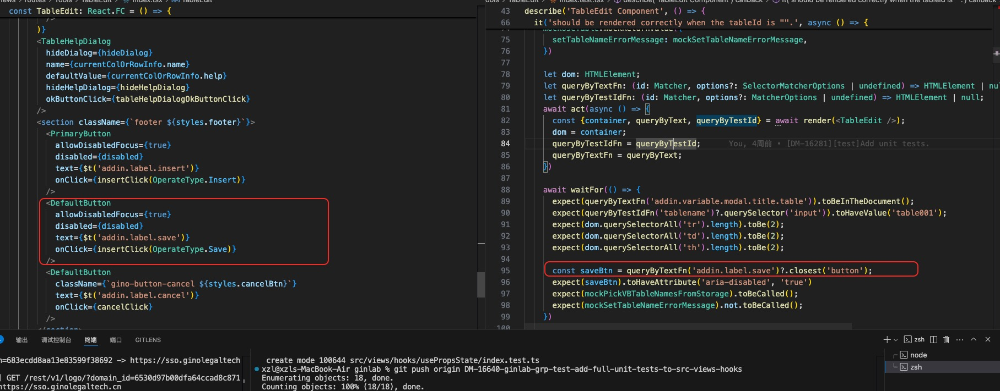

##### UI组件 / 无状态组件 的测试

仅包含UI的组件测试测试方式，主要通过传入不同的props，然后断言不同props下渲染结果即可。例如：

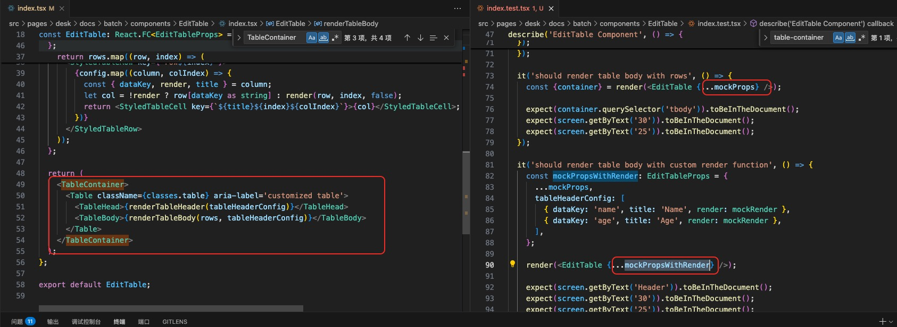

##### 含有useEffect和useState的组件

useEffec一般包含一些副作用操作（数据获取、事件监听等）；做测试时，如果包含异步测试操作，需要在act的回调函数中render待测组件。断言组件渲染是否符合预期即可；

eg: src/views/routes/Tools/Default/index

##### 测试iframe标签load事件

示例代码位置： src/views/routes/GinAiDialog/index

待测试示例代码如下：

```ts
import Loading from '@/components/loadingbox/Loading';
import { useState } from 'react';
import { useIframe } from './hooks/useIframe';
import { handleReceiveMessage } from './methods';

const Demo = () => {
  const [loading, setLoading] = useState<boolean>(true);

  const { src } = useIframe();

  const onLoaded = () => {
    setLoading(false);
  };

  const receiveMessage = (event) => {
    // receive message and handling
    // ...
    handleReceiveMessage(event);
  }

  useEffect(() => {
    window.addEventListener('message', receiveMessage);
    return () => {
      window.addEventListener('message', receiveMessage);
    };
  }, []);

  return (
    <>
      <iframe onLoad={onLoaded} src={src} frameBorder="0" width={'100%'} height={'100%'} />
      <Loading isShow={loading} className="loading-box"/>
    </>
  );
};

export default Demo;

```

完整的测试方案：

```ts
import { render, waitFor } from '@testing-library/react';
import Demo from '.';
import { useIframe } from './hooks/useIframe';
import { handleReceiveMessage } from './methods';
import React from 'react';

jest.mock('./hooks/useIframe', () => ({ useIframe: jest.fn() }));
jest.mock('./methods', () => ({ handleReceiveMessage: jest.fn() }));

describe('GinAi', () => {
  const mockUseIframe = useIframe as jest.Mock;
  const mockHandleReceiveMessage = handleReceiveMessage as jest.Mock;

  beforeEach(() => {
    jest.resetModules();
    jest.clearAllMocks();
  });

  it('renders iframe and loading component', () => {
    mockUseIframe.mockReturnValue({ src: 'https://example.com' });

    const { container } = render(<GinAi />);

    const iframeElement = container.querySelector('iframe');
    const loadingElement = container.querySelector('.loading-box');

    expect(iframeElement).toBeInTheDocument();
    expect(iframeElement).toHaveAttribute('src', 'https://example.com');
    expect(loadingElement).toBeInTheDocument();
  });

  it('hides loading component after iframe is loaded', () => {
    mockUseIframe.mockReturnValue({ src: 'https://example.com' });
    const setLoadingMock = jest.fn();

    jest.spyOn(React, 'useState').mockReturnValueOnce([true, setLoadingMock]);

    const { container } = render(<GinAi />);

    const iframeElement = container.querySelector('iframe');
    const loadingElement = container.querySelector('.loading-box');

    expect(iframeElement).toBeInTheDocument();
    expect(loadingElement).toBeInTheDocument();
    // 关键代码
    iframeElement?.dispatchEvent(new Event('load'));

    waitFor(() => {
      expect(setLoadingMock).toHaveBeenCalledWith(false);
      expect(loadingElement).not.toBeInTheDocument();
    });
  });

  it('handles received message of type "InsertTagString"', () => {
    mockUseIframe.mockReturnValue({ src: 'https://example.com' });

    const { container } = render(<GinAi />);

    const iframeElement = container.querySelector('iframe');
    iframeElement?.dispatchEvent(new Event('load'));

    const message = {
      type: 'messageData',
      data: { result: 'example' },
    };

    const messageEvent = new MessageEvent('message', {
      data: { result: 'example' },
      origin: window.location.origin,
    });

    window.dispatchEvent(messageEvent);

    waitFor(() => {
      expect(onMessageInsertTagStringMock).toHaveBeenCalledWith({ result: 'example' });
      expect(mockHandleReceiveMessage).toHaveBeenCalledWith({
        data: { result: 'example' },
        origin: window.location.origin,
      });
    });
  });
});

```

#### hooks测试

hooks的单元测试，使用renderHook对hooks进行渲染，ginlab项目中renderHook方法可以直接从@testing-library/react库里面导入；gindex项目中@testing-library/react版本较低，还未集成renderHook,gindex项目的renderHook可以从@testing-library/react-hooks这个库导入。

##### 包含useEffect的hooks单元测试

与测试组件类似，包含useEffect钩子的自定义hooks单元测试，需要喜在act的回调函数执行renderHook。如果useEffect中还包括异步的初始化，比如获取接口数据等，需要使用await等待渲染完成。

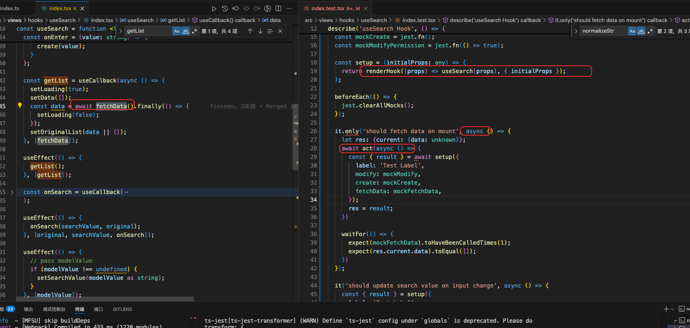

##### 测试window.addEventListener('message', receiveMessage)相关的hooks
示例代码位置：src/views/routes/GinAi/hooks/useReceiveMessage

待测试代码

```ts
// useReceiveMessage.ts
import { useMemoizedFn } from 'ahooks';
import { useEffect } from 'react';

export enum ReceiveMessageTypes {
  Add = 'add',
  Delete = 'delete',
  Update = 'update',
  Select = 'select',
}

export interface ReceiveMessageData {}

export interface OpenReceivedMessage {
  type: ReceiveMessageTypes;
  data: ReceiveMessageData;
}

export type ReceiveMessageCallbackMap = {
  [key in ReceiveMessageTypes]?: (data: ReceiveMessageData) => void;
};

export const useReciveMessage = (callbackMap?: ReceiveMessageCallbackMap) => {
  const receiveMessage = useMemoizedFn((e: MessageEvent<OpenReceivedMessage>) => {
    const { origin, data: messageInfo } = e;
    if (origin !== window.location.origin && __IsProd__) {
      return;
    }
    const { type, data } = messageInfo;
    callbackMap?.[type]?.(data);
  });

  useEffect(() => {
    window.addEventListener('message', receiveMessage);
    return () => {
      window.addEventListener('message', receiveMessage);
    };
  }, []);
};

```

上述的hooks使用方式：

```ts
import {useReciveMessage, ReceiveMessageTypes} from './useReceiveMessage';

const useHooksComponent = () => {
  const handleAdd = () => {};
  const handleDelete = () => {};

  useReciveMessage({
    [ReceiveMessageTypes.Add]: handleAdd,
    [ReceiveMessageTypes.Delete]: handleDelete,
    // ...
  })
}
```

单元测试

```ts
// useReceiveMessage.test.ts
import { useEffect } from 'react';
import { renderHook, waitFor } from '@testing-library/react';
import { useReciveMessage, OpenReceivedMessage, ReceiveMessageTypes } from '.';

describe('useReciveMessage', () => {
  // spyOn window.addEventListener;
  let mockAddEventListener: jest.SpyInstance;
  let mockRemoveEventListener: jest.SpyInstance;

  beforeEach(() => {
    mockAddEventListener = jest.spyOn(window, 'addEventListener');
    mockRemoveEventListener = jest.spyOn(window, 'removeEventListener');
  });

  afterEach(() => {
    // restore the mock modules.
    mockAddEventListener.mockRestore();
    mockRemoveEventListener.mockRestore();
  });

  it('should add and remove event listener', async () => {
    const callbackMap = {
      [ReceiveMessageTypes.Add]: jest.fn(),
    };

    await renderHook(() => useReciveMessage(callbackMap));

    waitFor(() => {
      expect(mockAddEventListener).toHaveBeenCalledTimes(1);
      expect(mockAddEventListener).toHaveBeenCalledWith('message', expect.any(Function));

      expect(mockRemoveEventListener).toHaveBeenCalledTimes(1);
      expect(mockRemoveEventListener).toHaveBeenCalledWith('message', expect.any(Function));
    });
  });

  it('should call the callback function when receiving a matching message', () => {
    const callbackMap = {
      [ReceiveMessageTypes.Add]: jest.fn(),
    };

    renderHook(() => useReciveMessage(callbackMap));

    const mockMessageEvent: MessageEvent<OpenReceivedMessage> = {
      origin: window.location.origin,
      data: {
        type: ReceiveMessageTypes.Add,
        data: { result: 'example' },
      },
    } as MessageEvent<OpenReceivedMessage>;

    // Get the receiveMessage function
    const receiveMessageHandler = mockAddEventListener.mock.calls[0][1];

    receiveMessageHandler(mockMessageEvent);

    expect(callbackMap[ReceiveMessageTypes.Add]).toHaveBeenCalledTimes(1);
    expect(callbackMap[ReceiveMessageTypes.Add]).toHaveBeenCalledWith({
      result: 'example',
    });
  });

  it('should not call the callback function when receiving a non-matching message', () => {
    const callbackMap = {
      [ReceiveMessageTypes.Unknown]: jest.fn(),
    };

    renderHook(() => useReciveMessage(callbackMap));

    const mockMessageEvent: MessageEvent<OpenReceivedMessage> = {
      origin: window.location.origin,
      data: {
        type: ReceiveMessageTypes.Add,
        data: { result: 'example' },
      },
    } as MessageEvent<OpenReceivedMessage>;

    const receiveMessageHandler = mockAddEventListener.mock.calls[0][1];

    receiveMessageHandler(mockMessageEvent);

    expect(callbackMap[ReceiveMessageTypes.Unknown]).not.toHaveBeenCalled();
  });

  it('should not call the callback function when origin is different in production', () => {
    const callbackMap = {
      [ReceiveMessageTypes.Add]: jest.fn(),
    };

    /**
     * Modify the return value of __IsProd__ in the global object inside jest.config.js
     */
    Object.defineProperty(global, '__IsProd__', {
      value: true,
    });

    renderHook(() => useReciveMessage(callbackMap));

    const mockMessageEvent: MessageEvent<OpenReceivedMessage> = {
      origin: 'https://example.com',
      data: {
        type: ReceiveMessageTypes.Add,
        data: { result: 'example' },
      },
    } as MessageEvent<OpenReceivedMessage>;

    const receiveMessageHandler = mockAddEventListener.mock.calls[0][1];

    receiveMessageHandler(mockMessageEvent);

    expect(callbackMap[ReceiveMessageTypes.Add]).not.toHaveBeenCalled();
  });
});
```

上述实例中的__IsProd__是定义的全局变量，原始代码中来源于const _isProd = process.env.NODE_ENV === 'production';该变量会在.umirc.ts中进行设置全局变量，具体如下：
```ts
import { defineConfig } from 'umi';
export default defineConfig({
  // ...
  define: {
    // ...
      __IsProd__: _isProd
    // ...
  }
  // ...
})

```

但是在jest中如果想要使用全局的变量，则需要在jest.config.js中进行配置，具体如下：

```js
import type { Config } from 'jest';

export default async (): Promise<Config> => {
  return {
    // ...
    global: {
      // ...
      '__IsProd__':  false,
      // ...
    }
    // ...
  }
}

```

##### 怎么测hooks中单个函数的逻辑？

renderHook渲染函数，可以得到渲染结果result对象，自定义hooks返回的对象属性可以在result.current中访问到，未return的，无法在result.current对象中访问到（hook私有函数）。

例如：测试自定义hooks上的私有函数onChange。

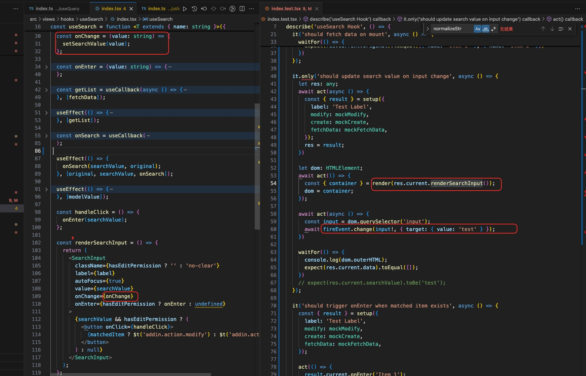

### 常见问题与调试技巧

#### 典型问题集锦

##### 主题色样式报错

错误信息如下：

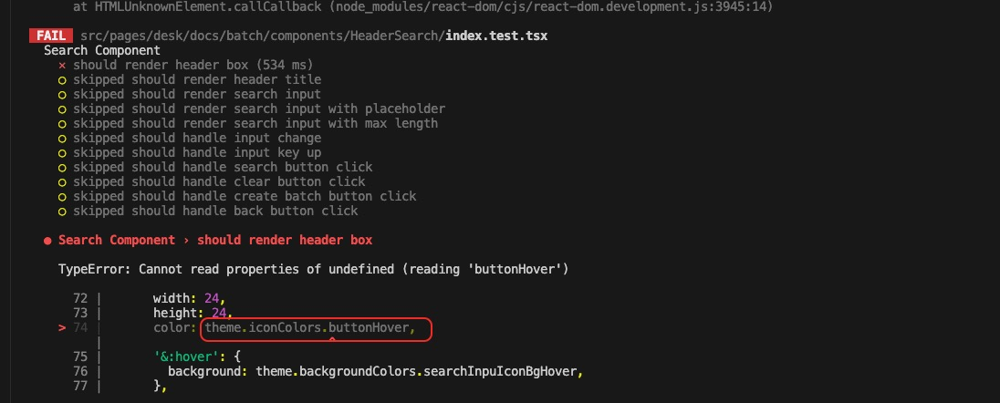

这里提示theme.iconColors为undefined，是因为测试代码render待测组件时，没有使用ThemeProvider包裹组件，所以会出现获取不到主题色相关的属性。

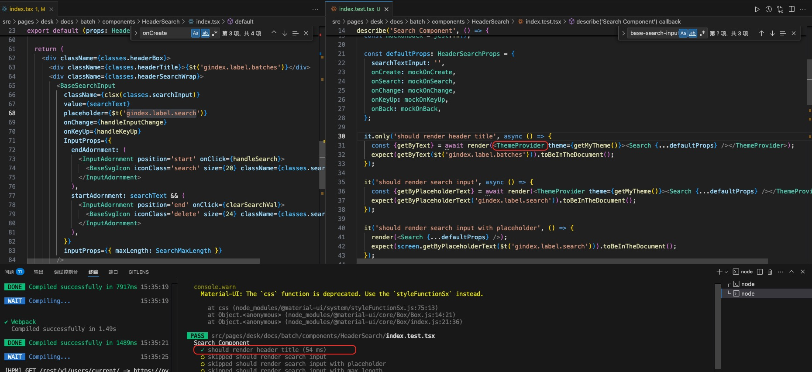


##### 遇到act报错提示

<b>缺少act包裹</b>

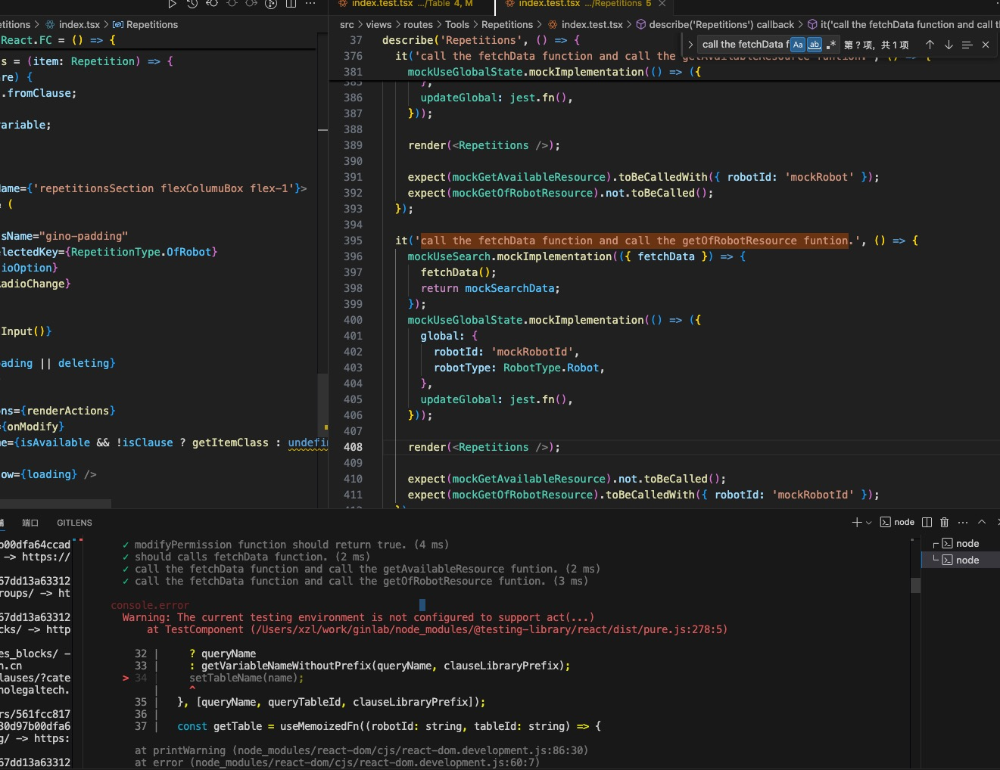

找到报错文件：拷贝最靠近报错信息的测试用例描述，搜索到具体位置；
然后给render方法套一层act，可以解决这个问题。
如果还是会报错，则act的callback方法使用async，await等待一下render执行完成。加上act后，断言要用waitFor的回调函数里面进行。

##### 测试组件时遇到Outlet报错。

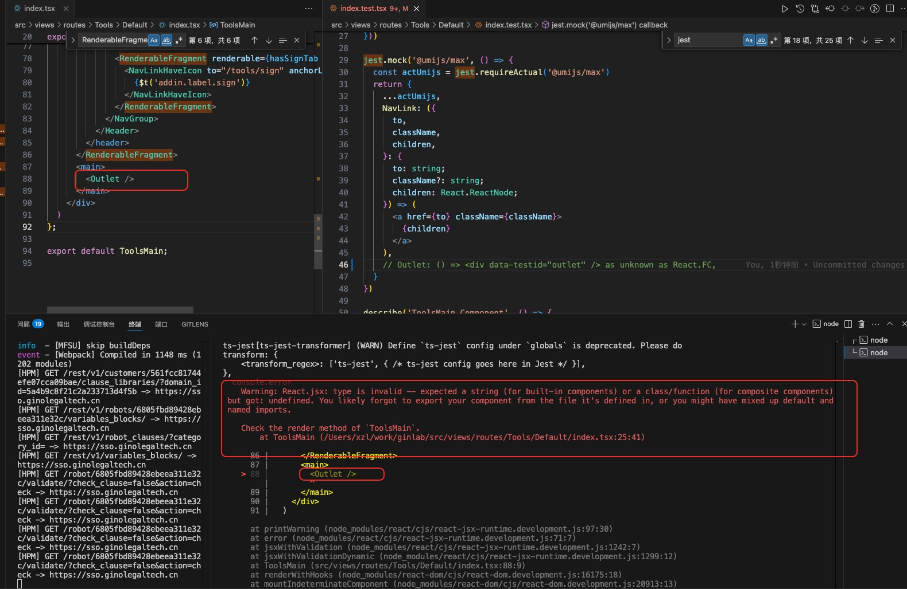

本质上是jest测试环境中没有正确配置react-router-dom的Outlet组件,react-router-dom组装在了umijs里面，这里遇到这个报错，建议直接将Outlet组件mock掉。

```tsx
jest.mock('@umijs/max', () => {
  const actUmijs = jest.requireActual('@umijs/max')
  return {
    ...actUmijs,
    Outlet: () => <div data-testid="outlet" /> as unknown as React.FC,
  }
})
```

##### 测试组件时遇到NavLink组件报错

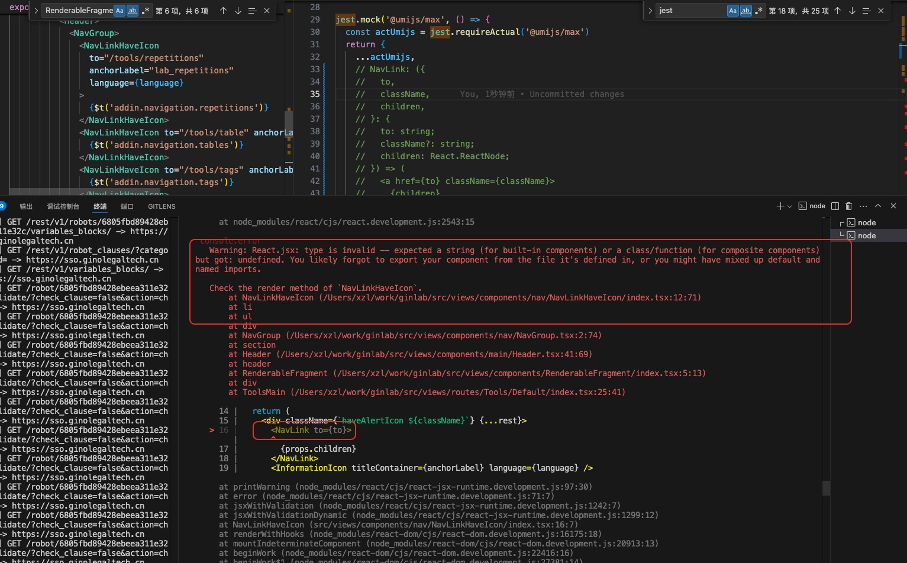

与面前的Outlet报错类似，为了解决组件对测试结果的影响，可以选择mock该组件。

```tsx
jest.mock('@umijs/max', () => {
  const actUmijs = jest.requireActual('@umijs/max')
  return {
    ...actUmijs,
    NavLink: ({
      to,
      className,
      children,
    }: {
      to: string;
      className?: string;
      children: React.ReactNode;
    }) => (
      <a href={to} className={className}>
        {children}
      </a>
    ),
  }
})
```


##### 当待测文件中有import一个图片文件时，出现报错：

待测文件

```tsx
import { FC, memo } from 'react';
import styles from './index.scss';
import emptyDataImg from '@/assets/icon/empty-data.svg';

interface Props {
  text: string;
}

const EmptyData: FC<Props> = function ({ text }) {
  return (
    <div className={styles.noData}>
      
      <p className="empty-text">{text}</p>
    </div>
  );
};
export default memo(EmptyData);
```

测试代码如下：

```tsx
import { render } from '@testing-library/react';
import EmptyData from '../index';

describe('EmptyData Component', () => {
  it('renders the component with the provided text', () => {
    const text = 'No data available';
    const { getByText } = render(<EmptyData text={text} />);
    const emptyTextElement = getByText(text);

    expect(emptyTextElement).toBeInTheDocument();
  });
});
```

报错信息如下：

```shell
 ● Test suite failed to run

    Jest encountered an unexpected token

    Jest failed to parse a file. This happens e.g. when your code or its dependencies use non-standard JavaScript syntax, or when Jest is not configured to support such syntax.

    Out of the box Jest supports Babel, which will be used to transform your files into valid JS based on your Babel configuration.

    By default "node_modules" folder is ignored by transformers.

    Here's what you can do:
     • If you are trying to use ECMAScript Modules, see https://jestjs.io/docs/ecmascript-modules for how to enable it.
     • If you are trying to use TypeScript, see https://jestjs.io/docs/getting-started#using-typescript
     • To have some of your "node_modules" files transformed, you can specify a custom "transformIgnorePatterns" in your config.
     • If you need a custom transformation specify a "transform" option in your config.
     • If you simply want to mock your non-JS modules (e.g. binary assets) you can stub them out with the "moduleNameMapper" config option.

    You'll find more details and examples of these config options in the docs:
    https://jestjs.io/docs/configuration
    For information about custom transformations, see:
    https://jestjs.io/docs/code-transformation

    Details:

    /Users/xzl/demo/src/assets/icon/empty-data.svg:1
    ({"Object.<anonymous>":function(module,exports,require,__dirname,__filename,jest){<?xml version="1.0" encoding="UTF-8"?>
                                                                                      ^

    SyntaxError: Unexpected token '<'

      1 | import { FC, memo } from 'react';
      2 | import styles from './index.scss';
    > 3 | import emptyDataImg from '@/assets/icon/empty-data.svg';
        | ^
      4 |
      5 | interface Props {
      6 |   text: string;

      at Runtime.createScriptFromCode (node_modules/jest-runtime/build/index.js:1495:14)
      at Object.<anonymous> (src/components/EmptyData/index.tsx:3:1)
      at Object.<anonymous> (src/components/EmptyData/__test__/index.test.tsx:2:1)

Test Suites: 1 failed, 1 total
Tests:       0 total
Snapshots:   0 total
Time:        107.825 s
Ran all test suites matching /src\/components\/EmptyData/i.
```
<b>解决办法：</b> 这是由于配置问题引起的，是缺少了解析某些文件的插件。需要让jest支持解析文件

具体步骤：

- 引入jest-transform-stub插件
- 在jest.config.ts中transform属性增加配置
  ```ts
  {
    // ....
    transform: {
      '\\.[jt]sx?$': 'ts-jest',
      ".+\\.(svg|css|styl|less|sass|scss|png|jpg|ttf|woff|woff2)$": "jest-transform-stub"
    },
    // ....
  }
  ```
重新启动测试，即可解决这个问题。

##### 当待测文件中，不存在报错信息提示的内容时，建议检查子组件中是否存在

例如：

报错信息如下
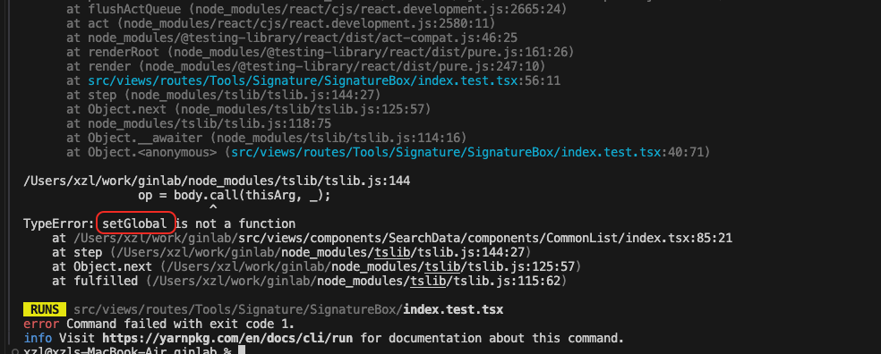

测试文件：
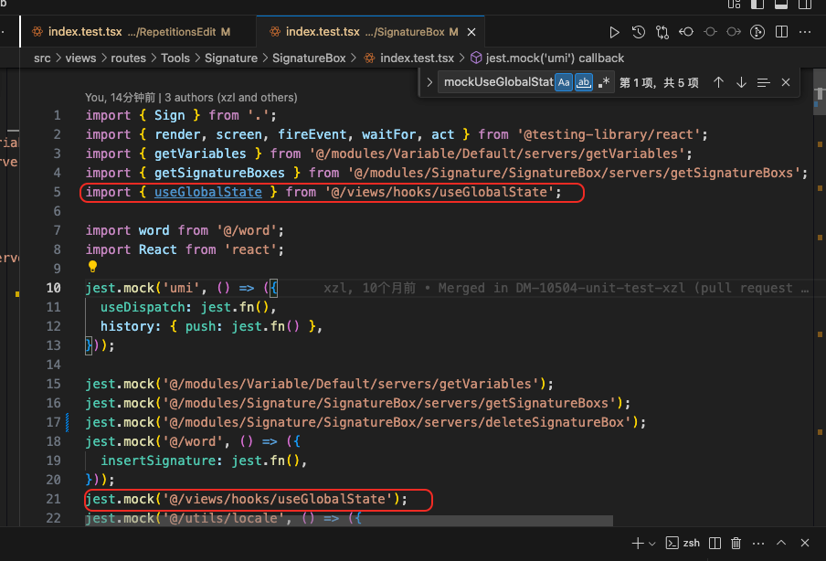

根据报错信息在待测的组件中搜索setGlobal，但是并未搜索到该函数，进入子组件中搜索，深层查找，发现了该bug。子组件中，有setGlobal,但是由于测试文件中没有从useGlobalState对应返回setGlobal,子组件中使用了setGlobal。

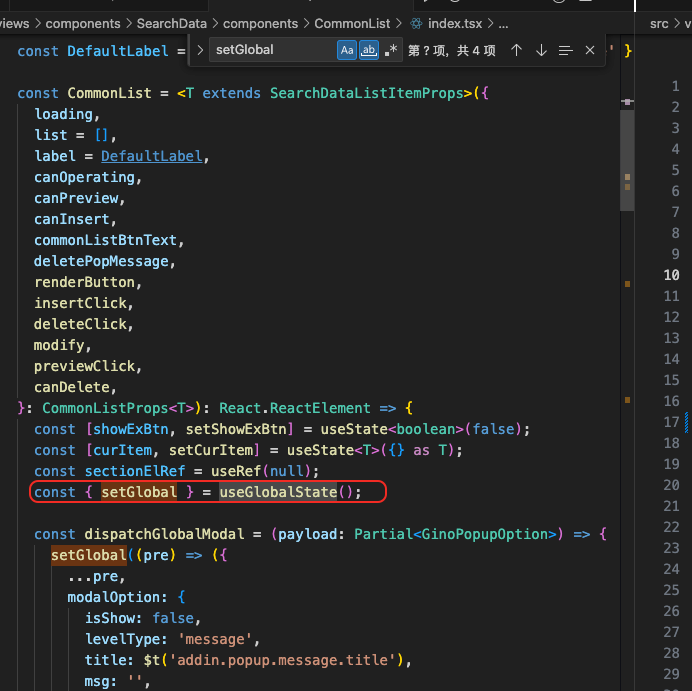


##### 测试select的时候，打印没有option,但是可以直接断言

eg: src/views/routes/Tools/Signature/SignatureBoxEditor/components/SignatureFieldSelect

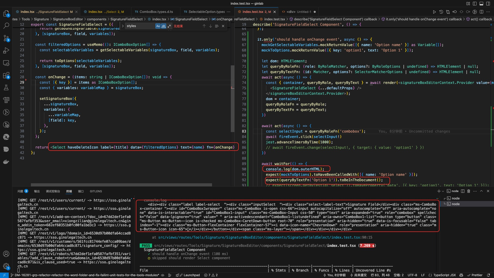

遇到上述情况，可以直接使用@testing-library/react库提供的查找元素方法去查找对应的options进行断言即可。

想要验证select的change事件中的逻辑，需要触发change事件，select不允许使用如下方式去选中

```tsx
const selectInput = queryByRoleFn('combobox');
await fireEvent.change(selectInput!, {traget: {value: 'Option 1'}});
```

可以使用如下方式操作触发change事件

```tsx
// 直接选中option，点击option来达到触发change事件
const option = queryByText('Option 1');
fireEvent.click(option!);
```

#### 常见的测试技巧mock篇

mock测试数据要根据实际代码去判断，哪些该mock哪些不该。可以参考如下：

- 引入的外部函数（可进行mock，方便断言）;
- 引入的接口函数建议mock;
- 引入的自定义hook可以mock
  * 一部分包括useEffect会影响到渲染的建议不用mock,按照集成测试来测，eg: Tools/TableEdit;
- 引入的外部组件，复杂的可以mock，简单的不mock, 
  * eg: Tools/RepetitionsEdit不需要进行mock组件;
  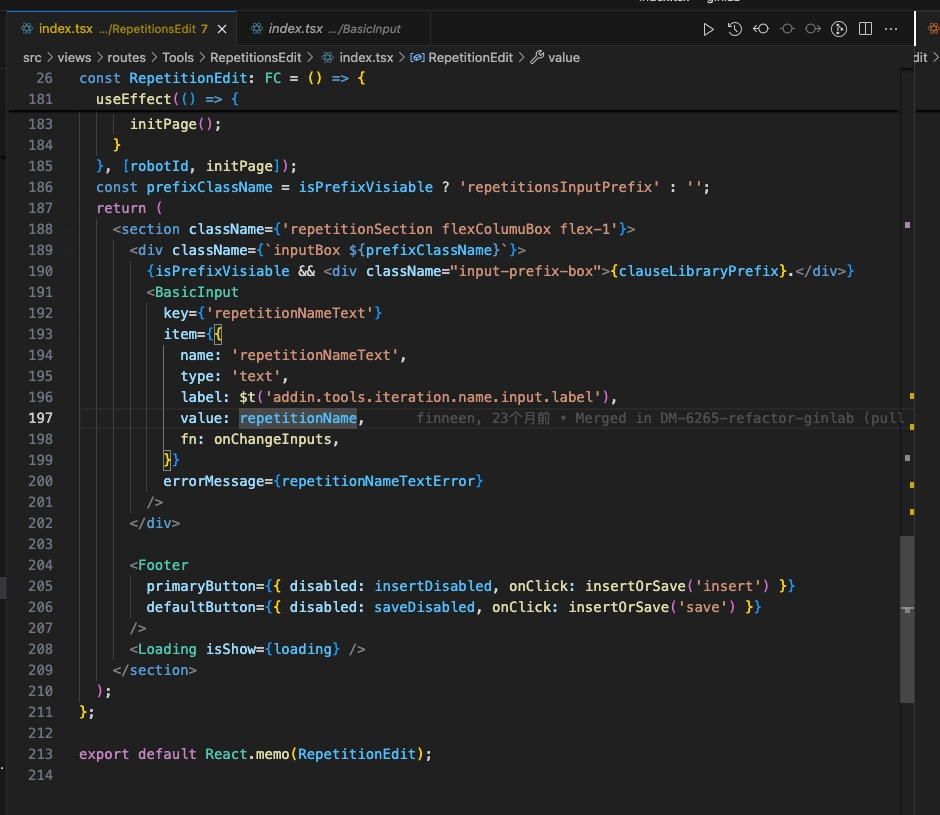

总结：如果待测内容中，需要用来作为断言的函数或者组件等需要mock,或者使用jest.spyOn打桩，以方便做断言。

##### 如何mock掉外部依赖?

mock外部依赖即mock待测文件中import的部分。一般可以使用jest.mock对整个import文件进行mock，也可以只mock一部分。

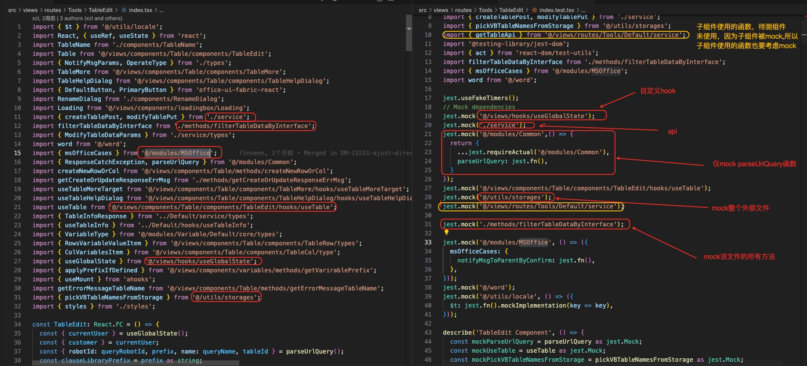

##### 怎么mock子组件和子组件触发事件？

- 直接mock子组件
  例如： mock umi中的组件NavLink和Outlet;
  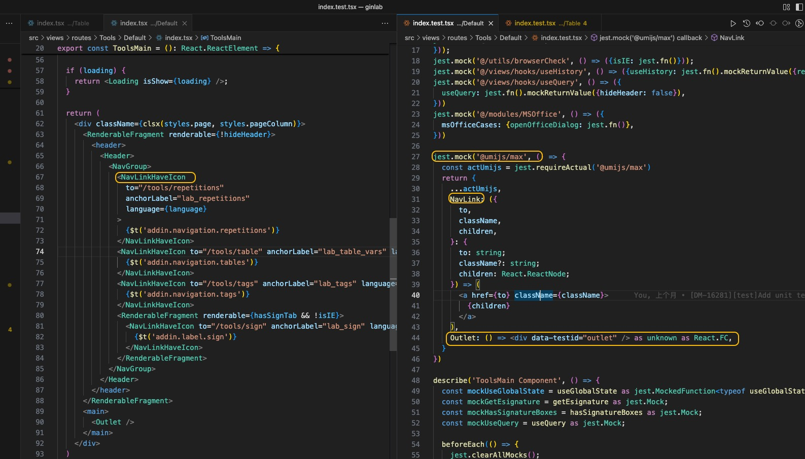

- 如果事件触发在子组件，实现在父组件，怎么测试父组件中函数？
  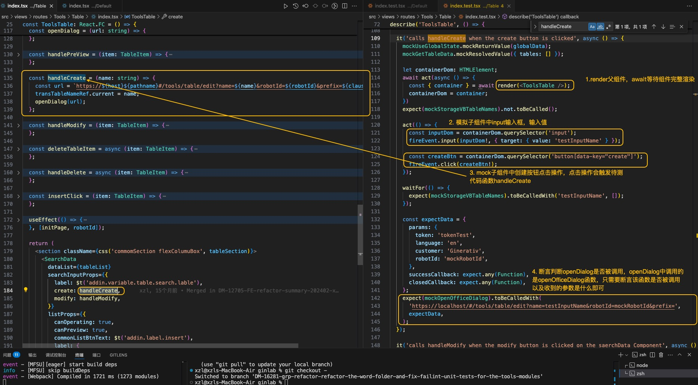

##### 对于需要保留原本功能的函数，怎么用来做断言？

对于需要保留原本功能函数，但是又需要函数能够被断言，需要使用jest.spyOn对函数进行打桩。

例1：给useState打桩
```ts
const mockSetDataList = jest.fn();
jest.spyOn(React, 'useState').mockReturnValue([[], mockSetDataList]);
// 随后再对组件/hook渲染（render/renderHook）,jest.spyOn包裹useState可以使得useState按照我们预设的值返回数据。
// 也可以辅助我们进行断言,例如：
epexct(mockSetDataList).toHaveBeenCalledWith([]);

```
例2: 给clearTimeout打桩

```ts
// 定时器一般结合useFakeTimers使用
jest.useFakeTimers();
jest.spyOn(global, 'clearTimeout');
jest.spyOn(global, 'setTimeout');
// 用spyOn打桩后，可以按照我们想要的进行断言
expect(clearTimeout).toBeCalledTimes(1);
```

总结：jest.spyOn不会改变clearTimerout等函数本身的功能，但是提供了对这些函数断言的能力。

##### 待测测试包含useContext的组件，怎么mock？

eg: src/views/routes/Tools/Signature/SignatureBoxEditor/components/

mock useContext的数据有以下几种方式：

1. 使用jest.mock对useContext进行mock；
2. 使用真实的Provider的包裹待测组件；
   
eg:
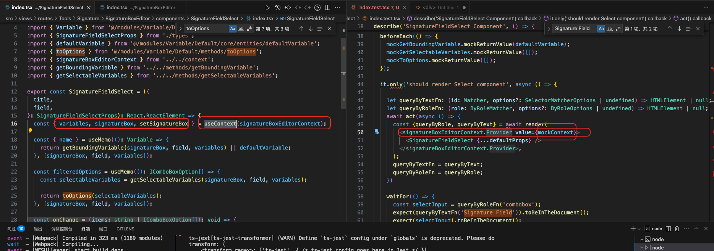


### 单元测试与持续集成

#### 测试覆盖率报告

##### 本地运行单元测试时，想要查看自己负责模块的单元测试覆盖率报告

```bash
# 例如：检查tools下面的测试覆盖率，执行如下命令
yarn test src/views/routes/Tools --coverage --collectCoverageFrom='src/views/routes/Tools/**/*.{js,ts,tsx}'
```
得到覆盖率报告：

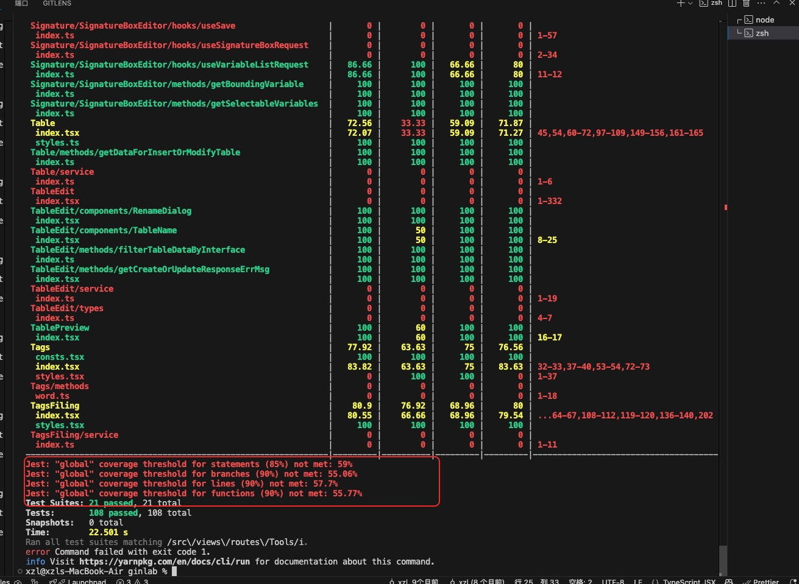


自动化测试流程

本地开发：Husky + lint-staged（提交前自动运行测试）

```shell
yarn test --onlyChanged # 只执行修改过程中涉及到的单测
```

CI/CD：GitHub Actions/Jenkins配置测试流水线

测试覆盖率报告

使用jest --coverage生成报告

覆盖率指标解读（80%以上是理想目标，但质量 > 数量）


###  总结与资源

从关键路径开始，逐步覆盖，着重测试边界和极限值。

测试代码和生产代码同等重要！

<b>学习资源推荐</b>

书籍：《Testing JavaScript Applications》

文档：Jest官方文档、Testing Library最佳实践

