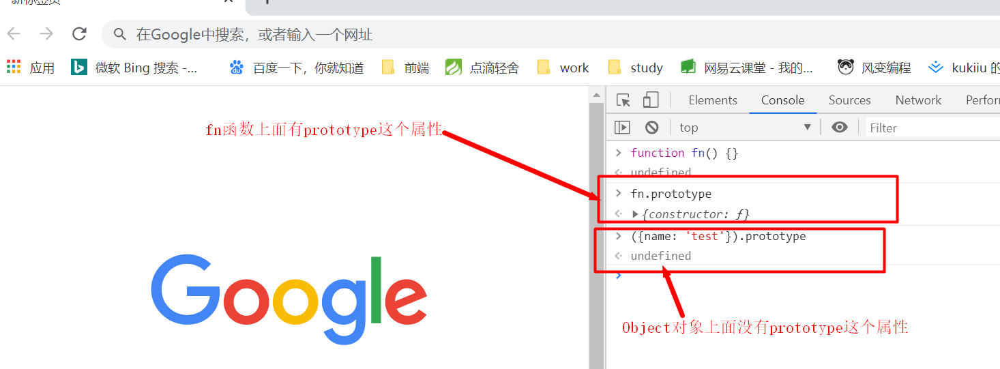
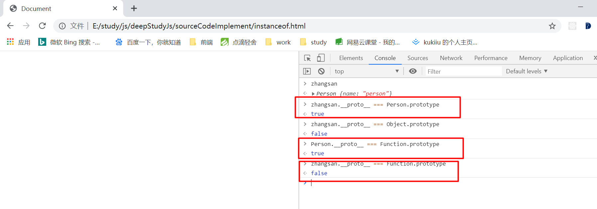
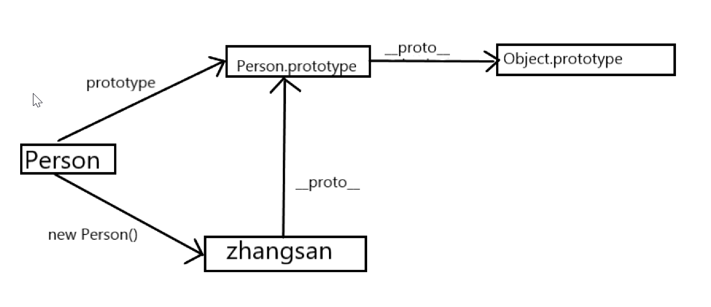
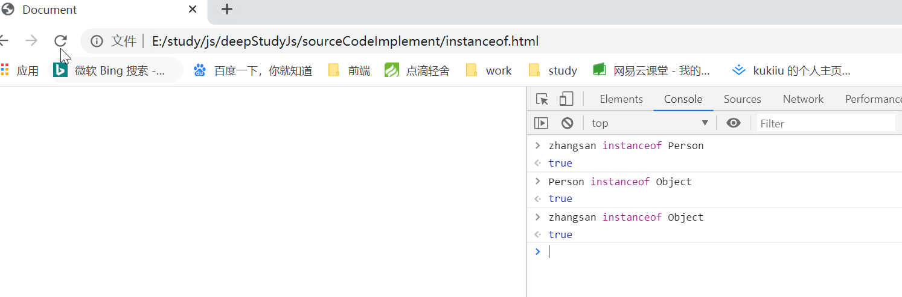

# instanceof运算符的探索

首先我们需要先了解instanceof的功能，在MDN上面关于instanceof的定义是这样的：`instanceof 运算符用于检测构造函数的 prototype 属性是否出现在某个实例对象的原型链上。`

提取关键字：构造函数、prototype、实例对象、原型链

有prototype和原型链，提到这两个关键词，我们应该马上想到的是prototype和__proto__这个东西，这两个是什么呢？我相信基本上在面试过程中，如果问你基础的问题，原型链基本是必考题。

那么__proto__和prototype他们是一个怎么样的关系呢？我们一起来探索这个问题。

## prototype&\_\_proto\_\_

我们需要明白的是：这两个属性是什么？为什么会出现这两个属性？它们可以做什么用？instanceof与这两个属性之间又有什么联系呢？

### 这两个属性是什么？

在js的世界中，万物皆对象，万物皆属性，这是我们的共识。

> 首先他们都是对象的属性

- prototype: 是函数对象的属性（只有函数才有），它是函数的原型对象
- \_\_proto\_\_: 是任意对象的属性（任何一个对象都有这个属性），它指向构造函数的原型对象


为了验证上述的说法，我们直接在浏览器的控制台进行校验 —— 打开google浏览器 -> `F12`

#### proptotype

我们可以创建一个空函数，function fn() {} -> 回车 -> 控制台 fn.prototype -> `{constructor: ƒ}`

通过上述我们可以看到，控制台最终的输出结果是一个包含`constructor`属性的对象，函数中存在prototype属性，当我们在控制台希望得到`({name: 'test'}).prototype`输出结果的时候,得到的是一个`undefined`



#### \_\_proto\_\_

在控制台随便输入一个对象我们可以看看里面的属性。

我们分别查看`{name: test}`、`function fn() {}`函数fn 、`[0, 1, 2]`对象，我们可以发现这些对象都有\_\_proto\_\_属性


*是任意对象的属性（任何一个对象都有这个属性）*

关于这两个属性的关系我们需要了解另外一个概念：<b>构造函数</b>

#### 现在我们来谈谈为什么需要prototype和__proto__以及构造函数的概念

在js中如果我们需要创建一个实例，我们一般的做法是new一个对象，就像下面这样

```js
function Person() {
    this.name = 'person'
}

// p 是Person的实例对象，Person是p的构造函数，p是通过Person构造出来的。
var p = new Person()
```

现在我们知道，一个函数如果构造（new）出了一个对象,那么这个函数Person就是我们p的构造函数。我想有这么一个实际的例子，大家应该很快能够理解到构造函数这个概念。

prototype我们都知道，只要是函数对象都会有这个属性，它本身就是一个对象。

假如我们有多个Person的实例，同时多个实例对象我们实现了同样的功能，我们希望能够紧紧写一次这个方法就可以在所有的实例对象中去共享这个方法，此时，prototype就诞生了，prototype引用的就是一个干净的对象，prototype是Person上的属性，但是指向了这个干净的对象。我们的实例想要共享这个干净的对象上面的这块内存地址，js就通过给实例对象上面添加的__proto__来指向这个干净的对象，也就是说proptotype是构造函数的原型对象，而__proto__指向这个构造函数的原型对象。

这里可能会有点绕，但是我们可以通过实例来验证一下。

> 新建一个html文件
```html
<!DOCTYPE html>
<html lang="en">

<head>
    <meta charset="UTF-8">
    <meta name="viewport" content="width=device-width, initial-scale=1.0">
    <title>Document</title>
</head>

<body>
    <script>

        // proptotype & __proto__

        function Person() {
            this.name = 'person'
        }

        var zhangsan = new Person()

    </script>
</body>

</html>
```

在浏览器打开这个文件，我们看一下我们的验证结果：



从结果上看我们可以知道：实例zhangsan.\_\_proto\_\_ 与Person.prototype是全等的，也就是说他们指向的都是同一块内存地址的内容。

从图中我们还看到了，我们进行了Person.\_\_proto\_\_ === Function.prototype验证，结果为true,但是Function.proptotype不等于实例(zhangsan)的\_\_proto\_\_。

我们都知道的一个概念：如果我们要去访问一个实例上面的属性和方法时，他首先会找实例对象自己有没有，没有的话，他就会去找构造函数和构造函数的原型对象上面有没有，如果没有他就会继续往构造函数的构造函数原型对象上面的找这个属性和方法，直到到达顶部的Object。也就是我们的原型链（\_\_proto\_\_）,链接构造函数原型对象和实例对象之前的桥梁。

为了达到这个效果，我们引出了当前的这个概念instanceof。为了检测某个构造函数的prototype是否出现在某个实例的原型链上。

### 运用instanceof

用上面例子中的html来做验证，我们通过上述代码我们可以画出prototype、\_\_proto\_\_以及instanceof之间的关系图。



图中，我们看到实际上\_\_proto\_\_链接着他的构造函数的prototype，一级一级往前找，由此形成一个链条，也就是我们所说的原型链。

而instanceof就是用于检查某个函数的prototype是否在这个构造函数的原型链上面。

通过上图我们可以猜测出：
- zhangsan instanceof Person // true,因为Person是zhangsan的构造函数Person.prototype在zhangsan的原型链上。
- Person.prototype instanceof Object  // true, Object.prototype在Person.prototype.\_\_proto\_\_上
- zhangsan instanceof Object // true, Object.prototype在zhangsan这个实例对象的原型链上



上图验证了我们的猜想，现在我们用过了instanceof，我相信我们对它的用法一定已经有了一个了解。往下我们将实现它的源码，来进一步的深入理解。

### 实现instanceof

想要检查函数的prototype是否在原型链上面，我们只需要判断实例对象的\_\_proto\_\_与构造函数的prototype是否相等即可。

新建一个myInstanceof.js文件
```js
function myInstanceof(instanceFunc, protoObject) {
    // 检查instanceFunc函数的原型链是否有protoObject的原型对象
    
    function checkProto(_instanceA, _protoObjB) {
        var result = false

        if (!_instanceA.__proto__) {
            return false
        }

        if (_instanceA.__proto__ !== _protoObjB.prototype) {
            result = checkProto(_instanceA.__proto__, _protoObjB)
        } else {
            return true
        }

        return result
    }

    return checkProto(instanceFunc, protoObject)
}

function Animail(type) {
    this.type = type
}

function Person() {
    this.name = 'person'
}

var zhangsan = new Person()

// 验证instanceof基础功能功能
console.log(myInstanceof(zhangsan, Person)) // true
console.log(myInstanceof(zhangsan, Object)) // true
console.log(myInstanceof(zhangsan, Animail)) // false
```

上述代码实现了基本的检查某个构造函数的prototype是否存在于实例对象的原型链上。因为instanceof是一个运算符，在js中我们不好去重写它，所以我直接使用一个myInstanceof函数来实现相同的功能。

### 验证实现效果

```js
function myInstanceof(instanceFunc, protoObject) {
    // 省略具体实现，与上面代码一致
}

// 定义构造函数
function C(){} 
function D(){} 

var o = new C();

console.log(o instanceof C) // true
console.log(myInstanceof(o, C)) // true

console.log(o instanceof D) // false
console.log(myInstanceof(o, D)) // false

console.log(o instanceof Object) // true
console.log(myInstanceof(o, Object)) // true

console.log(C.prototype instanceof Object) // true
console.log(myInstanceof(C.prototype, Object)) // true

// 修改构造函数C的原型对象指向
C.prototype = {}
var o2 = new C()

console.log(o2 instanceof C) // true
console.log(myInstanceof(o2, C)) // true

// 因为此时C.prototype不在o的原型链上面
console.log(o instanceof C) // false
console.log(myInstanceof(o, C)) // false

// 继承
D.prototype = new C(); 
var o3 = new D()

console.log(o3 instanceof D) // true
console.log(myInstanceof(o3, D)) // true

console.log(o3 instanceof C) // true
console.log(myInstanceof(o3, C)) // true
```

我们可以看到验证结果，每个结果都与原来的instanceof运算符效果一致。这是基本功能的验证。

### 特殊情况下的instanceof

instanceof运算符有一个特殊的情况：如果是基本数据类型，即非对象类型的数据，例如: 使用字面量的方式直接创建的一个字符串，这个字符串instanceof String输出结果是false

```js
function myInstanceof(instanceFunc, protoObject) {
    // 省略具体实现，与上面代码一致
}
// ....

var simpleStr = "This is a simple string"; 

console.log(simpleStr instanceof String); // 返回 false, 检查原型链会找到 undefined
console.log(myInstanceof(simpleStr, String)) // true
```

在上述的代码验证中我们可以看到，目前我们的myInstanceof函数与实际的instanceof的功能有出入，为什么会产生这种差别呢？

因为simpleStr变量在我们做运算前会有一个装箱操作（这里不展开，展开内容太多，感兴趣可以自己去研究一下）。会将simpleStr当成是一个String对象，但是我们实际获得simpleStr它是一个字面量而不是对象。

这里我们需要修改一下我们的myInstanceof

```js
function myInstanceof(instanceFunc, protoObject) {
    // 首先检查的情况下我们检查的必须是非基本类型，即类型必须为对象， 新增加类型检测，这里我借助了typeof运算符来帮我检测
    if (typeof instanceFunc !== 'object') {
        return false
    }

    // ... 上述过程中的内容
}
```

现在我们再次对我们的myInstanceof进行验证

```js
var simpleStr = "This is a simple string"; 

console.log(simpleStr instanceof String); // 返回 false, 检查原型链会找到 undefined
console.log(myInstanceof(simpleStr, String)) // false
```
我们得到了与原生instanceof运算符一样的结果，为了避免影响基础功能，我将原来的那些验证也再次进行了验证，之前的代码并没有受到新添加的这句代码的影响。

我们接下来做更多的校验
```js
var simpleStr = "This is a simple string"; 

console.log(simpleStr instanceof String); // 返回 false, 检查原型链会找到 undefined
console.log(myInstanceof(simpleStr, String)) // false

var myString  = new String();
var myDate    = new Date();

console.log(myString  instanceof String); // true
console.log(myInstanceof(myString, String)); // true

console.log(myString  instanceof Object); // true
console.log(myInstanceof(myString, Object)); // true

console.log(myString instanceof Date); // false
console.log(myInstanceof(myString, Date)); // false


var myObj     = {};

console.log(myObj instanceof Object); // true
console.log(myInstanceof(myObj, Object)); // true

console.log(({})  instanceof Object);  // true
console.log(myInstanceof({}, Object)); // true


var myNonObj  = Object.create(null);

console.log(myNonObj instanceof Object); // false
console.log(myInstanceof(myNonObj, Object)); // false


var newStr    = new String("String created with constructor");

console.log(newStr instanceof String); // 返回 true
console.log(myInstanceof(newStr, String)); // true

console.log(myDate instanceof Date);     // 返回 true
console.log(myInstanceof(myDate, Date));  // true

console.log(myDate instanceof Object);   // 返回 true
console.log(myInstanceof(myDate, Object)); // true

console.log(myDate instanceof String);   // 返回 false
console.log(myInstanceof(myDate, String)); // false
```
通过众多测试，我们也可以看到目前而言我们想要instanceof功能已经基本实现了。最后我们实现的完整代码如下：

```js
function myInstanceof(instanceFunc, protoObject) {
    // 检查instanceFunc函数的原型链是否有protoObject的原型对象
    // 首先检查的情况下我们检查的必须是非基本类型，即类型必须为对象
    if (typeof instanceFunc !== 'object') {
        return false
    }

    function checkProto(_instanceA, _protoObjB) {
        var result = false

        if (!_instanceA.__proto__) {
            return false
        }

        if (_instanceA.__proto__ !== _protoObjB.prototype) {
            result = checkProto(_instanceA.__proto__, _protoObjB)
        } else {
            return true
        }

        return result
    }

    return checkProto(instanceFunc, protoObject)
}
```
如果我的这篇文章能为您带来些帮助，我会很开心。当然如果说我的文章中有什么错漏的也欢迎大家给我留言，让我们一起进步。


