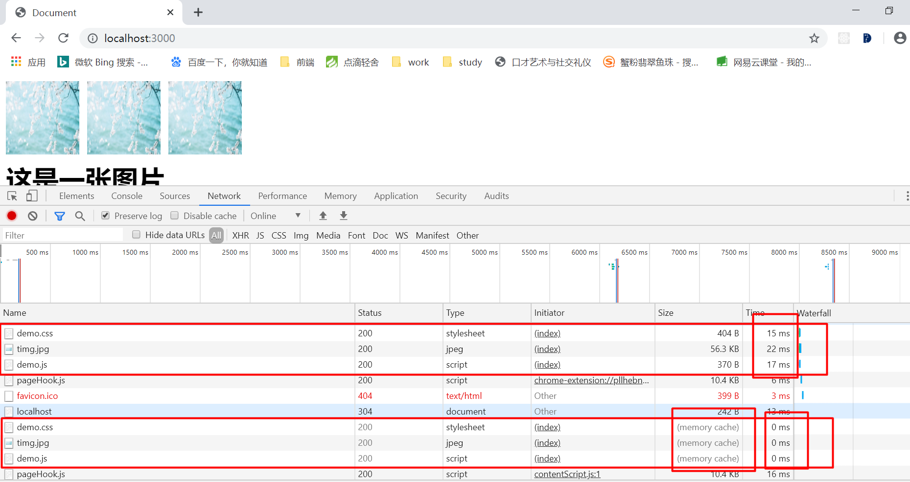
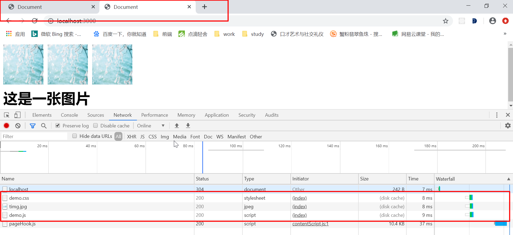
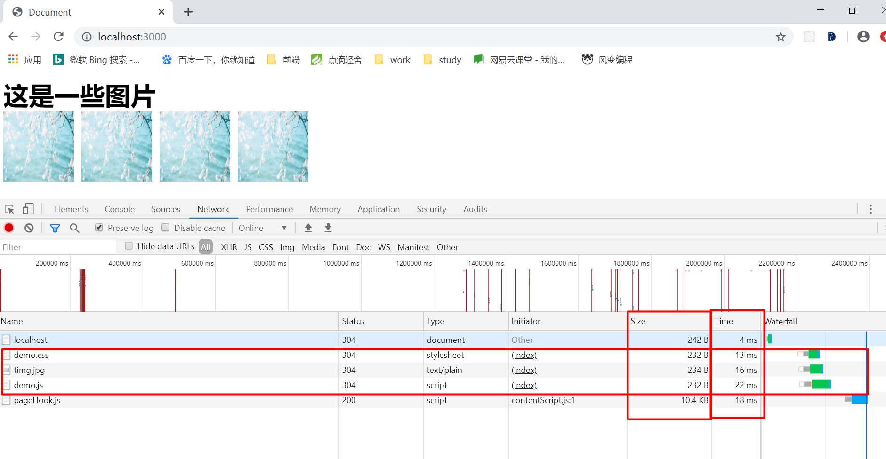
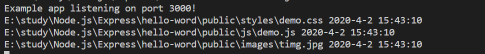
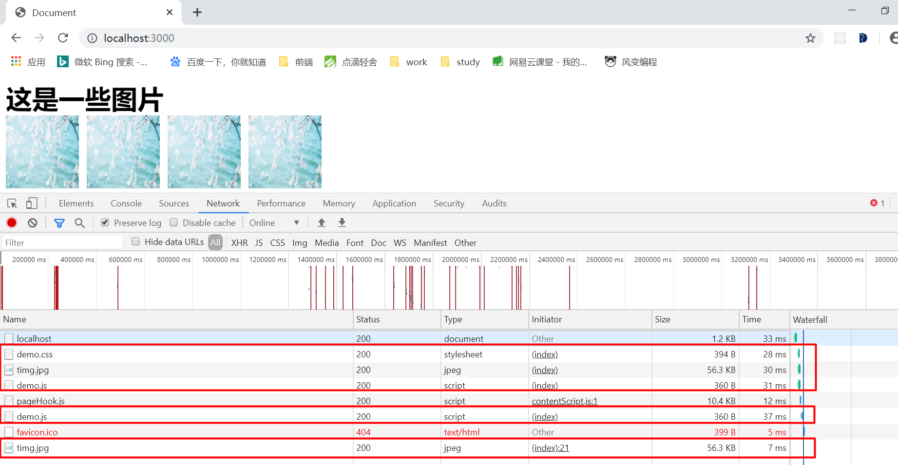
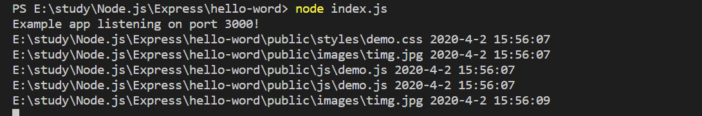
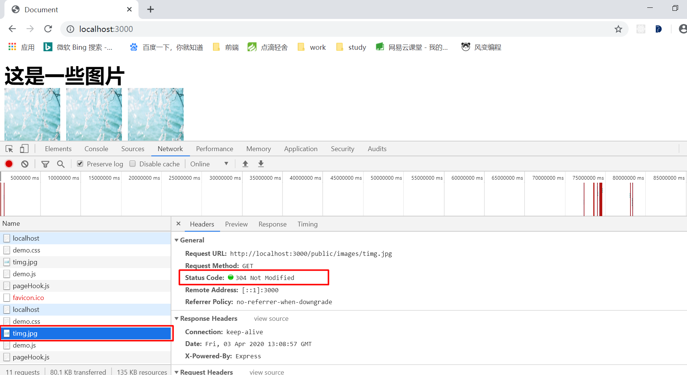

# 缓存学习

*参考链接： https://zhuanlan.zhihu.com/p/44789005*

## 前言

面试过程中总会出现谈谈http缓存机制，谈谈你对浏览器缓存的理解等等问题。今天我将针对缓存问题谈谈我理解的缓存世界以及缓存机制。

谈到缓存，首先理解其定义 —— 高速数据交换的存储器。从中我们可以抓住几个关键词：高速、数据、存储器。从定义中我们需要明白两个问题

```md
1. 数据获取方式有哪些？
2. 各数据获取速度顺序是怎么样的？
```

1. 数据获取方式有哪些？

```md
网络请求、硬盘、固态硬盘、内存、高速缓冲存储器等等
```

CPU读取数速度：高速缓冲存储器 -> 内存 -> 固态硬盘 -> 硬盘 -> 网络请求

*数据库的数据也可以看成是本地磁盘上面存储的文件数据，只不过文件格式不是普通的文件，读取速度抛开其他，单论读取速度，磁盘文件的读取速度比数据库的要更加快。只不过数据库可以对数据进行管理*

### 概念
综上所述，我们所说的高速缓冲存储器，就是我们物理意义上的缓存。然而除了我们物理意义上面的缓存，我们还有很多其他概念意义的缓存，这种缓存不是真实的物理存储器，而是我们为了达到数据交互提速的目的，出现的产物。这里我们需要重点关注的就是`网络请求`。

### 网络请求

网络请求三个基本的阶段：请求，处理，响应

这三个阶段中，处理属于后端缓存；而请求和响应则属于前端缓存。

### 缓存分类

#### 分类： 前端缓存、后端缓存

##### 前端缓存

前端缓存主要关注的还是浏览器缓存，App的缓存这里暂不做介绍。
浏览器缓存分类有多种

按照存储位置来分：memory cache, disk cache, Service Worker
按照失效策略来分：Cache-Control,Etag

##### 按照存储位置的分类：

###### memory cache缓存
memory cache 是浏览器为了加快读取缓存速度而进行的自身的优化行为，不受开发者控制，也不受http协议头的约束，算是一个黑盒。

memory cache缓存是内存中的缓存，几乎所有的网络请求资源都会被浏览器自动加入到memory cache中，memory cache只能是"短期存储"。通常，浏览器关闭标签页后，memory cache就会失效。极端情况下（例如一个页面的缓存占用了超级多的内存），那可能会在标签没关闭前，前面的缓存就已经失效。

浏览器从memory cache获取缓存内容时，浏览器会忽视max-age=0,no-cache等头部配置（no-store除外）。

###### disk cache
这种缓存也叫做http cache,这是一种存储在硬盘上的缓存，它是持久存储的，实际存在于文件系统中。它允许共享缓存（相同的资源在跨会话，甚至是跨站点的情况下使用）。

disk cache的使用，根据http头信息可以知道是否可缓存，是否需要重新请求。disk cache既然是一种持久存储，那么面临容量增长的问题时，浏览器有自己的底层算法把“最老的”的，或者“最可能过时的”资源删除，它是一个一个删除的过程。每个浏览器的删除算法不尽相同，可能存在差异性。

###### Service Worker
Service Worker是由开发者编写的额外的脚本，且缓存位置独立，出现也较晚，使用还不算太广泛。

前面两种缓存的缓存策略，包括缓存/读取/失效都是由浏览器内部判断&进行的，我们只能设置响应头的某些字段告诉浏览器，而不能自己操作。我们可以通过Application->Cache Storage中找到这个“存储器”，这个缓存是永久性的，即使关闭了浏览器标签，下次打开缓存依然还存在。有两种情况会导致这个缓存中的资源被清除

* 手动调用API: cache.delete(resource)
* 或者容量超过限制，被浏览器全部清空

当Service Worker没能命中缓存，一般情况下，会使用fetch()方法继续获取资源。经过Service Worker的fetch方法获取的资源，即便它并没有命中Service Worker缓存，甚至实际走了网络请求，也会标注为from ServiceWorker.


> 综上内容，资源添加到缓存的过程如下

- 根据Service Worker中的handler决定是否存入Cache Storage(额外的存储位置)
- 根据http头部相关字段（Cache-control,pragma等）决定是否存入disk cache
- memory cache保存一份资源的引用，以备下次使用 

> 读取缓存的过程则如下：

- 先读取memory cache中缓存的资源
- 如果memory cache中找不到，则查看disk cache缓存的资源
- 最后查找Service Worker中缓存的资源
- 如果Service Worker中也找不到，那么浏览器就会用Service Worker中的fetch方法发起请求。


##### 按照失效策略的分类：

我们可以分为强缓存和协商缓存，这两个缓存方式其实都可以归类到disk cache中，disk cache也是平时我们最为熟悉的所谓http cache(因为不像memory cache,它遵守http协议头中的字段)。平时所说的强制缓存，对比缓存和Cache-Control等，也归类为这一类。

###### 强制缓存(强缓存)

强缓存是当客户端请求后，会先访问缓存数据，看缓存是否存在，如果存在则直接取缓存数据；如果不存在则请求真的服务器，响应后再写入缓存数据库。

强缓存直接减少请求次数，是提升最大的缓存策略。它包括了提到过的数据请求的全部三个步骤，如果考虑使用缓存来优化网页性能的话，强缓存应该首先被考虑。

可以实现强制缓存的字段是Cache-Control(http1.1)和expires(http1.0)

> Expires 

表示缓存到期时间，是一个绝对的时间（当前时间+缓存时间），例如：

```
Expires: Thu, 10 Dec 2020 16:54:43 GMT
```
这个响应头告诉浏览器，在未过期之前不需要再次去请求。
弊端：
1. 写法复杂。容易人为性的出错
2. 时间计量方式可能出现不统一的情况，服务器给的时间可能和本地（自己的电脑设置）时间不一致。

> Cache-Control

该字段可以表示资源缓存的最大有效时间（相对时间——时间间隔），例如：

```
Cache-Control: public, max-age=20000
```

这个字段有几个常用的值：

```md
客户端（请求req）:
Cache-Control: max-age=<seconds> 缓存存储的最大周期，超过这个时间缓存被认为过期（单位秒）
Cache-Control: no-cache 在发布缓存副本之前，强制要求缓存把请求提交给原始服务器进行验证（协商缓存验证）
Cache-Control: no-store 表示无论什么情况，都不会进行缓存，即使max-age有值且未过期，也不会缓存任何内容

服务器（响应res）：

Cache-Control: no-cache 在发布缓存副本之前，强制要求缓存把请求提交给原始服务器进行验证（协商缓存验证），Pragma字段是该属性值的兼容解决方案，在http1.1之前使用，需要设置Pragma: no-cache
Cache-Control: no-store 表示无论什么情况，都不会进行缓存，即使max-age有值且未过期，也不会缓存任何内容
Cache-Control: public 表示缓存可以被任何对象（发送请求的客户端，代理服务器等）缓存，即使通常不可缓存的内容（1.该相应没有max-age指令或者expires消息头；2.响应对应的请求方法是post）
Cache-Control: private 表示缓存只能被单个客户端缓存，不能作为共享缓存（即代理服务器不能缓存它）。对应用户的本地浏览器。
Cache-Control: must-revalidate 一旦资源过期（比如max-age已经超时），在成功向原始服务器验证之前，缓存不能用该资源响应后续请求。
```

*总结：Cache-Control的优先级要高于Expires,为了兼容实际项目中两个字段我们都会设置；此外Cache-Control的属性值优先级：no-store > no-cache > public(private) > max-age*

###### 协商缓存

当强制缓存失效（超过规定时间）时，就需要使用对比缓存（协商缓存），由服务器决定缓存内容是否失效

浏览器先请求缓存数据库，返回一个缓存标识。之后浏览器拿这个标识和服务器通讯。如果缓存未失效，则返回http状态码304表示继续使用，于是客户端继续使用缓存；如果失效，则返回新的数据和缓存规则，浏览器响应数据后，再把规则写入缓存数据库。

协商缓存再请求数据和没有缓存是一致的，返回结果304的话，仅仅返回一个状态码，并没有实际的文件内容，因此，协商缓存优化的是再响应体体积上的节省。

> Last-Modified & If-Modified-Since

- 服务器通过Last-Modified字段告知客户端，资源最后一次被修改的时间
- 浏览器将这个值和内容一起记录再缓存数据库中
- 下一次请求相同资源时，浏览器从自己的缓存中找出“不确定是否过期的”缓存。因此在请求头中将上次的Last-Modified的值写入到请求头的If-Modified-Since字段
- 服务器会将If-Modified-Since的值与Last-Modified字段进行对比，如果相等，则返回304，表示未修改；反之，则表示修改了，响应200状态码和数据

缺陷：
1. 如果资源更新速度是秒以下单位，该缓存是不能被使用的，因为它的时间单位最低是秒
2. 如果文件是通过服务器动态生成的，那么该方法的更新时间永远是生成的时间，尽管文件可能没有变化，所以起不到缓存的作用。

> Etag & If-None-Match

Etag存储的是文件的特殊标识（一般是hash生成的），服务器存储着文件的Etag字段。之后的流程和Last-Modified一致。

*Etag的优先级高于Last-Modified*


##### 缓存效果验证（重点强缓存的几种属性值效果）

###### 准备工作：创建一个新的express项目

- mkdir demo 新建一个目录
- cd demo & npm init 初始化npm,此时会自动生成一个package.json文件
- npm i express --save 安装express包
- 在项目根目录下新建一个index.js文件，文件新增如下内容

```js
const express = require('express')
const path = require('path')

const router = require('./router')

const prot = 3000
const app = express()

app.use(router)

const cacheOptions = {
    // TODO some prototype ...
}

app.use('/public', express.static(path.join(__dirname, 'public'), cacheOptions));

app.listen(prot, () => console.log(`Example app listening on port ${port}!`))
```

- 在根目录下创建一个router目录，且在router目录下创建一个index.js，文件添加如下代码
```js
const express = require('express')
const app = express()
const router = express.Router()

router.get('/', (req, res, next) => {
    res.sendFile(path.join(__dirname, '../View/demo.html'))
})
```

- 在根目录下创建一个View目录，View目录下面创建一个demo.html,添加html代码
```html
<!DOCTYPE html>
<html lang="en">
<head>
    <meta charset="UTF-8">
    <meta name="viewport" content="width=device-width, initial-scale=1.0">
    <title>Document</title>
    <!-- 引入css文件 -->
    <link rel="stylesheet" href="/public/styles/demo.css">
</head>
<body>
    <!-- 引入一张图片 -->
    
    <div>这是一张图片</div>
    <!-- 引入js文件 -->
    <script src="/public/js/demo.js"></script>
</body>
</html>
```

- 在根目录下新建public目录， 目录下面新建三个文件夹：images,js,styles；public目录以及文件如下

```
- public
    - images 
        - timg.jpg
    - js
        - demo.js
    - styles
        - demo.css
```

###### 区分memory cache & disk cache

> 修改根目录下的index.js文件内容
```js
const cacheOptions = {
    maxAge: '20000', // 设置max-age的值为20秒
}

app.use('/public', express.static(path.join(__dirname, 'public'), cacheOptions));
```

运行node index.js，现在我们可以访问浏览器localhost:3000,查看网络请求可以看到下面的结果：
> 第一次请求，所有文件都发送了请求


> 点击浏览器上方的刷新，再次请求数据



通过图片我们可以看到，相比首次请求，第二次的请求时间几乎在0ms就完成了，数据获取来源变成了from memory cache,此时页面的数据是从memory cache中直接取出来的。

> 我们复制浏览器上面的地址，新打开一个标签页（先打开f12）



上图我们可以看到，页面上面的数据 `from disk cache`已经清楚告诉我们，数据是直接从disk cache中获取的。获取数据时间8-9ms比从服务器获取数据的15~17ms节省了一半的时间，这都是使用缓存的优势。

*disk cache更换浏览器的标签页，还可以保存资源，数据是持久的保存的，没有达到过期时间，数据依旧可用。但是memory cache的数据会被清空，所以，浏览器才回去disk cache中拿数据*

###### 区分no-store & no-cache

1. 修改View/index.html文件,每个请求都设置为请求多次

```html
<!DOCTYPE html>
<html lang="en">
<head>
    <meta charset="UTF-8">
    <meta name="viewport" content="width=device-width, initial-scale=1.0">
    <title>Document</title>
    <link rel="stylesheet" href="/public/styles/demo.css">
    <link rel="stylesheet" href="/public/styles/demo.css">
</head>
<body>
    <div>这是一些图片</div>
    
    
    
    <script src="/public/js/demo.js"></script>
    <script src="/public/js/demo.js"></script>

    <script>
        setTimeout(function() {
            let img = document.createElement('img')
            img.src = '/public/images/timg.jpg'
            document.body.appendChild(img)
        }, 2000)
    </script>
</body>
</html>
```

2. 同时修改根目录下的index.js文件

```js
const cacheOptions = {
    // maxAge: '20000', // 注释掉，避免影响
    
    setHeaders: function (res, path, stat) {
        // + 打印出每次请求public目录下的路径信息
        console.log(path, (new Date()).toLocaleString())
        res.set('Cache-Control', 'no-cache')
    }
}
app.use('/public', express.static(path.join(__dirname, 'public'), cacheOptions));
```

3. 执行node index.js,起node服务

> 通过浏览器访问localhost:3000


代码写了加载多次，但是实际上，浏览器上面只记录了一次请求发送

服务端也只收到了一次请求logger

*1. 页面的多个请求合并到一起，只请求了一次，当我们已经请求之后，页面的数据，浏览器会缓存起来，直接从缓存中获取，但是f12看不到来自哪种缓存。但是浏览器会自动把html当次请求的资源放到memory cache中，避免同一个src请求多次。*
*2. 使用setTimeout异步去请求同样的src时，实际上服务器并没有收到异步的请求，请求记录依然只有一次，由此可以看出setTimeout异步取到的数据来源于缓存中*

4. 修改根目录下的index.js文件

```js
// ...
const cacheOptions = {
    // maxAge: '20000',
    
    setHeaders: function (res, path, stat) {
        console.log(path, (new Date()).toLocaleString())
        res.set('Cache-Control', 'no-store')
    }
}
// ....
```

重启服务：node index.js

> 清空浏览器缓存重新新加载页面



浏览器上面显示，js文件被加载了两次，img图片也被加载了两次



服务器logger显示，js是连续加载了两次，img图片也加载了两次，第二次加载时间是在第一次加载的2秒钟之后。


==*根据上述情况，可以看出：*
*1. 异步请求，在设置Cache-Control: no-store的情况下，memory cache不起作用，不会缓存异步请求的数据*
*2. memory cache在同步请求数据时，依旧起作用，所以同时多次请求静态资源的时候，只请求了一次*==

###### 实践对比缓存（Etag/Last-no-match）

这里我使用jpg图片的加载来举例

1. 修改根目录下的index.js文件

```js
// ...
const cacheOptions = {
    maxAge: '4000', // 去除注释，且过期时间改为4秒
}
// ...
```

2. 修改router/index.js文件

```js
const express = require('express')
var path = require('path');

const router = express.Router()

router.get(/.*jpg$/, (req, res) => {
    console.log('我执行了', req.headers['if-none-match'])
    // 简单设置一个值。一般项目中不会这么做，项目中一般会使用文件摘要（hash），这里为了图省事直接使用url
    const url = path.join(__dirname, './public/images/timg.jpg')
    // 如果用户已经请求过一次，直接告诉浏览器去缓存里面取，缓存数据可用
    if (req.headers['if-none-match'] === url) {
        // 只设置头部，返回304
        res.writeHead(304, 'Not Modified');
        // 结束请求响应
        res.end()
    } else {
        // 如果还没有请求过图片，设置头部Etag,返回图片
        res.setHeader('Etag', url);
        res.sendFile(path.join(__dirname, '../public/images/timg.jpg'))
    }
});

router.get('/', (_req, res) => {
    res.sendFile(path.join(__dirname, '../View/demo.html'))
})

module.exports = router
```

> 清空缓存刷新浏览器（重新访问localhost:3000）


上图我们可以看到，请求都是结果都是200（成功），jpg图片请求时间为27ms

> 紧接着刷新页面


图中我们可以对比第一次请求和第二次请求图片的结果，第二次请求结果状态码为304，且请求时间由原来的27ms变成了13ms




图中请求返回状态码为`304 Not modified`(我们在router/index.js里面设置的值)；并且显示第二次请求图片时，请求头中带上了If-None-Match字段，属性值为我们设置的url；但是我们在第一次请求中请求头中并没有If-None-Match,发送请求我们并没有自己去设置请求，说明这个If-None-Match是浏览器自己帮我们添加上去的，如下图可以看到第一次请求并没有If-None-Match。


*上述过程中，页面第一次请求图片的时候，服务器端直接返回页面；当我们的浏览器缓存过期后（max-age过期），浏览器请求页面时，在请求头中自动带上了If-None-Match的值，这个值是我们第一次返回图片设置的头的Etag的值。*


###### ==Service Worker实践==


##### 常见缓存的应用

###### 不经常改变的资源，可以使用max-age设置一个较大的缓存时间值

这种方式，如果我们的资源有更新，我们可以结合使用文件摘要（Hash值）或者版本号，来对新的资源文件进行命名，或者添加到路由上，解决资源文件不能及时更新的问题。

###### 如果是经常变化的资源

可以使用
```
Cache-Control: no-cache
结合协商缓存（Etag & If-None-Match）来实现
```

###### 不推荐将上述两种缓存方式结合使用

no-cache设置后，缓存是浏览器自身的一种自发行为。如果浏览器在某个时间点清除了js文件，但是css和图片资源并没有被清除，此时js已经进行过更新，那么我们就将拿到新的js和旧的css以及图片，呈现的页面效果可想而知；这不是我们希望出现的结果。所以不推荐在项目中将上述两种缓存方式结合使用。

##### 共享缓存


