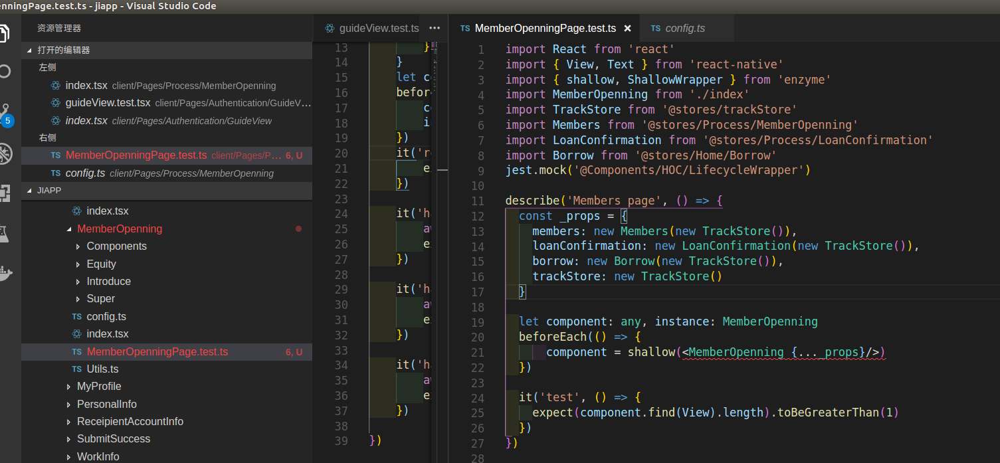

## Enzyme单元测试

#### 使用shallow浅渲染进行测试时一直提示错误
错误示例：

##### 错误分析：
- 检查是否写错单词
- 检查是否基本语法用错了，看其他人写的代码，也是同样的写法，语法应该没问题
- 晃眼发现了问题的根本——该测试使用的是.ts文件。.ts文件并不会去识别jsx语法，识别jsx语法，需要使用tsx文件
##### 最后解决办法： 将文件名后缀.ts换成.tsx问题解决

