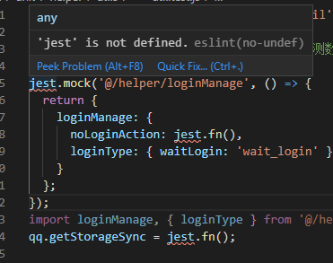

### eslint进行语法检查时，expect/describe/it/test爆红未定义

> 错误信息如下：



#### 分析

eslint配置问题，不支持jest

#### 解决办法

##### 单个文件解决（不推荐）

使用了jest/expect/describe/it/test等变量的测试文件中，增加单个eslint规则
```js
/* eslint-disable no-undef */ // 直接忽略未定义的变量
```

##### 修改eslint配置（推荐）

###### 安装eslint的插件

```node
npm i --D eslint-plugin-jest
```

###### 修改 .eslintrc.js文件

```js
module.exports = { 
    env: {
        // ... 其他配置
        jest: true // 这里的环境需要启用，否则不起作用
    },
    // ... 其他配置
    plugins: ["jest"]
}
```

###### 此时我们再去测试文件，可以看到之前的警告已经得到解决。


