# umi3升级到umi4后单元测试无法远行问题记录

## 运行单元测试报错信息如下：

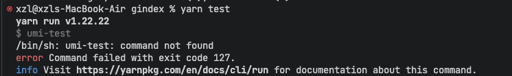

## 基础环境

- 操作系统：macOS Sonoma 14.7.4
- Node.js 版本：v22.16.0
- npm 版本：10.9.2
- umi 版本："@umijs/max": "^4.4.12",
- react 版本："^18.3.1",
- jest 版本："^30.1.3",
- @testing-library/react 版本："^16.3.0",

## 单元测试启动命令

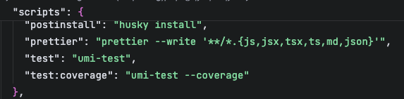

## 分析及解决问题

1. **查看启动脚本**

```shell
"test": "umi-test"
```

查看umi4相关配置文档，并没有提及到这个指令，且jest中也没有该指令。猜测应该是该指令在升级后，已经不可用。

重新写运行单元测试的指令：

```shell
"test": "cross-env jest --config=config/jest/jest.config.ts"
```

2. **调整package.json中的test指令后，运行单元测试，出现如下错误**

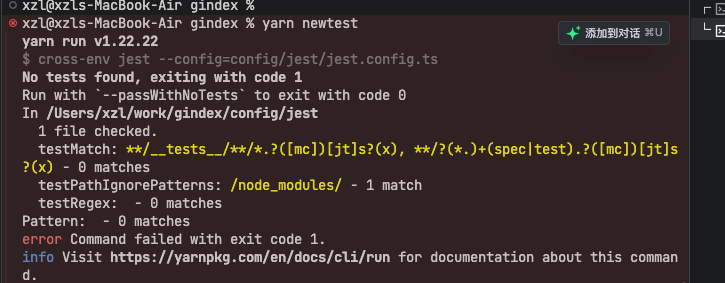

从错误信息可以看出，是匹配不到单元测试，导致单元测试无法运行。

```typescript
testMatch: ['**/__tests__/**/*.[jt]s?(x)', '**/?(*.)+(spec|test).[jt]s?(x)'],
```

从配置项可以看出，jest会匹配到`__tests__`目录下的所有测试文件，以及`src`目录下所有以`spec`或`test`结尾的文件。

检查项目中是否存在`__tests__`目录，以及是否存在符合命名规范的测试文件。

如果确认配置项正确，且测试文件存在，但是单元测试仍然无法运行，可能是由于其他配置问题导致的。此时需要检查其他配置项，如`transform`、`moduleNameMapper`等。

通过查看jest.config.ts文件，可以确认当前的rootDir没有指定目录，所以配置内容错误。原始的jest.conft.ts配置如下：

```ts
/** @jest-config-loader ts-node */
// or
/** @jest-config-loader esbuild-register */

import type {Config} from 'jest';

const config: Config = {
  verbose: true,
  testEnvironment: 'jsdom',
  moduleNameMapper: {
    '\\.(css|less|sass|scss|stylus)$': require.resolve('identity-obj-proxy'),
    '^@testing$': '<rootDir>/testing',
    '^@testing/(.*)$': '<rootDir>/testing/$1',
    '^@/(.*)$': '<rootDir>/src/$1',
  },
  coveragePathIgnorePatterns: ['<rootDir>/src/.umi/', '<rootDir>/src/assets/'],
  globals: {
    __EnvMode__: '',
    __IsLocale__: true,
    __SENTRYRELEASE__: '',
    __DexPath__: '',
    __AdminPath__: '',
    __WSUrl__: '',
    __DisableSocket__: false,
    __RocketChatWebSocketUrl__: '',
    __BlobWorkerPath__: '',
    __RocketChatPreUrl__: '',
    __RocketChatMiddleWarePreUrl__: '',
    __RocketChatDomain__: '',
    __IsDev__: true,
    __IsProd__: false,
    __IsTest__: true,
    __IsFormalProd__: false,
    __StaticHost__: '',
    __MainHost__: '',
    __AddinPath__: '',
    __WriterPath__: '',
    __HelpPath__: '',
    __BLOB_WORKER_PATH__: '',
    __ENVMODE__: '',
    __SENTRYDSN__: '',
    __IsDebugForPopupMessage__: false,
    __TRACE_AUTH__: '',
    __TRACE_URL__: '',
    __ChatAIMiddleWarePreUrl__: '',
  },
};

export default config;
```
上述配置使用了rootDir，但是没有指定目录，导致jest无法匹配到测试文件。

**解决办法**
在jest.config.ts中添加rootDir配置项，指定项目根目录。

```ts
/** @jest-config-loader ts-node */
// or
/** @jest-config-loader esbuild-register */

import type {Config} from 'jest';

const config: Config = {
  verbose: true,
  testEnvironment: 'jsdom',
  rootDir: '../../', // jest.config.ts所在目录为config/jest，指定目录为项目根目录，所以需要指定../../
  // ... 其他配置项
```
3. **修改jest.config.ts配置之后，运行单元测试，单元测试能正常跑起来，但是出现了其他的问题***

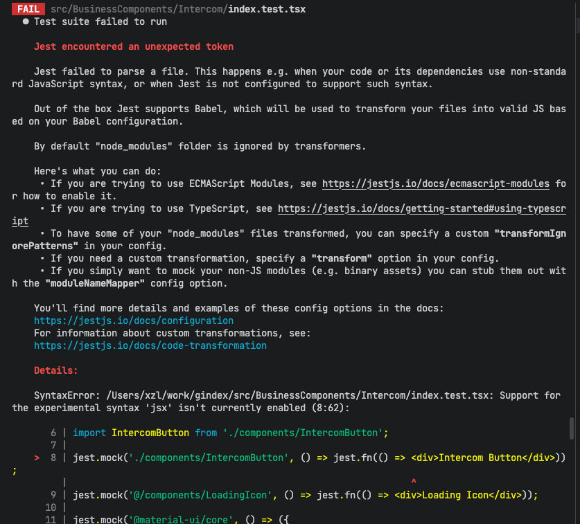

通过查看jest的配置项以及报错信息给出的错误，发现transform配置项没有指定，导致jest无法解析ts文件。

**解决办法**
在jest.config.ts中添加preset和transform配置项，指定ts文件的解析器。

```ts
/** @jest-config-loader ts-node */
// or
/** @jest-config-loader esbuild-register */

import type {Config} from 'jest';

const config: Config = {
  verbose: true,
  testEnvironment: 'jsdom',
  rootDir: '../../', // jest.config.ts所在目录为config/jest，指定目录为项目根目录，所以需要指定../../
  preset: 'ts-jest',
  transform: {
    '^.+\\.(ts|tsx)$': 'ts-jest',
  },
  // ... 其他配置项
}
```

此时还是会有问题，首先jest.config.ts文件本身是一个ts文件，需要配置，使得jest.config.ts文件能够被解析，在tsconfig.json中添加如下配置项：

```json
{
  // ... 其他配置项
  "compilerOptions": {
    // ... 其他配置项
    "types": ["reflect-metadata", "jest", "node"],
    // ... 其他配置项
  }
  // ... 其他配置项
}
```

4. **修改jest.config.ts配置之后，运行单元测试，出现很多的无法引入常用的测试函数以及断言函数出现报错**

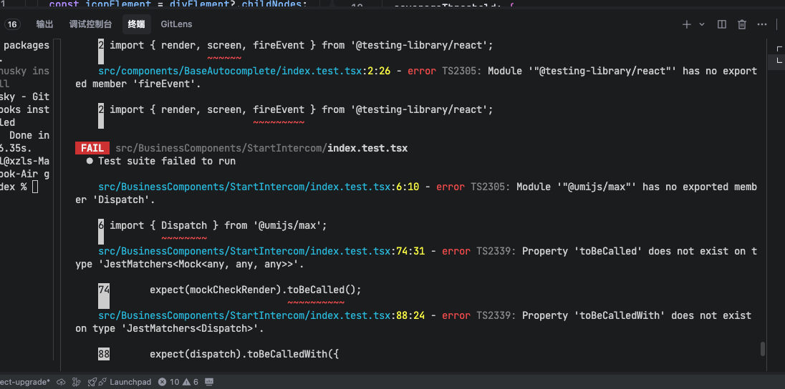

引用问题，多数与包本身有问题，此处用的语法是ts，检查是否jest版本和解析器ts-jest版本是否匹配。以及@types/jest版本是否匹配。
查看项目中各包版本

```
"jest": "^30.1.3",
"jest-canvas-mock": "^2.5.2",
"jest-environment-jsdom": "^30.1.2",
"jest-transform-stub": "^2.0.0",
"ts-jest": "^29.4.1",
"@jest/globals": "^30.1.2",
"@types/jest": "^30.0.0",
"@testing-library/jest-dom": "^6.8.0",
"@testing-library/react": "^16.3.0",
```
通过命令查看ts-jest当前版本依赖什么版本

```shell
npm info ts-jest
```

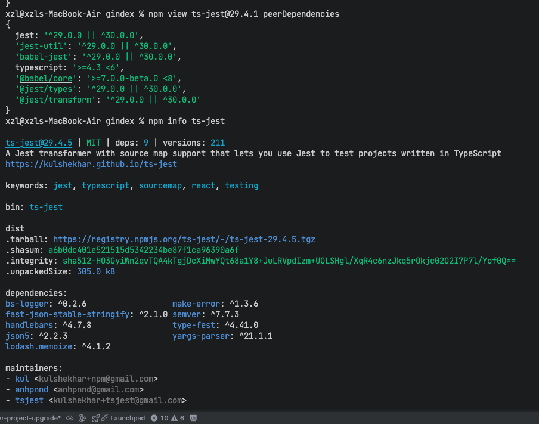

通过对ts-jest的版本检查，并没有出现版本不兼容问题，需要再另外查看单元测试很多跑不过的问题。

报错信息中提示引入的@testing-library/react库中某些method引入错误，根据报错信息，先查看@testing-library/reat官方文档，目前最新版本为16.3.0，官方文档推荐@testing-library/react 16+版本适用于react 18+, 并且还需要配合@testing-library/dom使用，但是当前的项目中并没有安装@testing-library/dom，先尝试安装@testing-library/dom，看是否能够解决一部分报错。

```shell
yarn add @testing-library/dom --save-dev
```
部分报错问题得到解决，但是还有一些报错问题，继续查看报错信息。

5. 运行单元测试，还会出现报错，但是需要仔细研究报错消息，根据报错提示来一个个解决问题。首先解决如下的getDvaData函数报错问题。

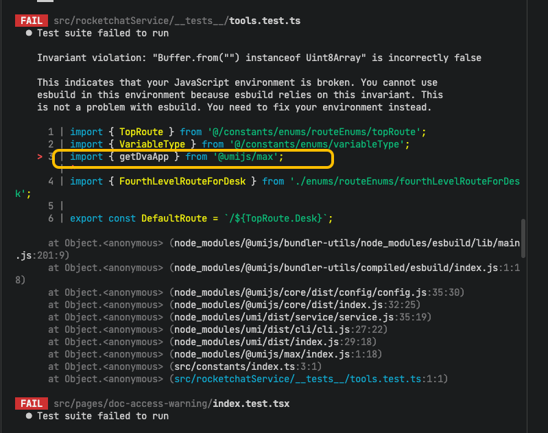

交给ai帮助分析问题，ai给出的分析是，jest测试环境中Buffer实现与预期不符合，esbuild在jest测试环境中遇到兼容性问题，解决办法是直接mock掉@umi/max中用到的一些方法。

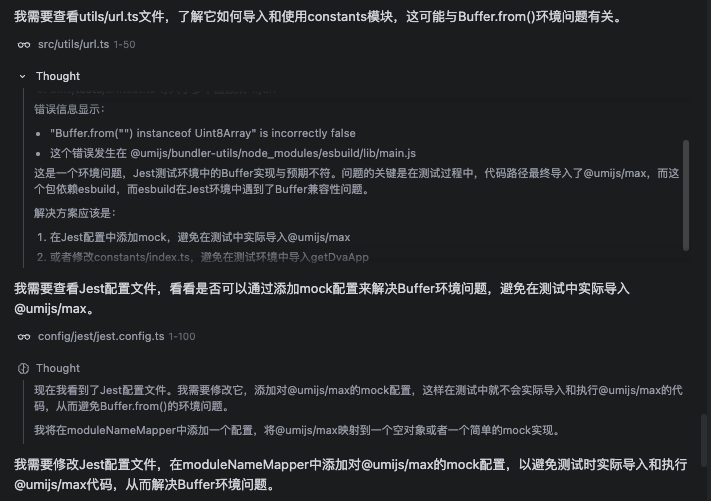

**具体解决方式如下：**
 
在jest.config.ts配置项中添加如下配置项

```ts
const config: Config = {
  // ... 其他配置项
  moduleNameMapper: {
    '\\.(css|less|sass|scss|stylus)$': require.resolve('identity-obj-proxy'),
    '^@testing$': '<rootDir>/testing',
    '^@testing/(.*)$': '<rootDir>/testing/$1',
    '^@/(.*)$': '<rootDir>/src/$1',
    '^@umijs/max$': '<rootDir>/testing/mockUmiMax.js', // 模拟@umijs/max模块,在对应的目录创建mockUmiMax.js文件
  },
  // ...其他配置项
}
export default config;
```
在mockUmiMax.js文件中添加如下代码

```ts
module.exports = {
  // Mock getDvaApp function that's causing issues
  getDvaApp: jest.fn(() => ({
    _store: {
      dispatch: jest.fn(),
      getState: jest.fn(() => ({})),
    },
  })),
  // Add other commonly used exports from @umijs/max as needed
  getLocale: jest.fn(() => 'en-US'),
  setLocale: jest.fn(),
  getIntl: jest.fn(() => ({
    formatMessage: jest.fn(({ id }) => id),
  })),
};
```
完成以上配置改动，解决了刚刚的getDvaData函数报错问题。

6. 运行单元测试，发现还存在waitFor的问题，具体报错如下：

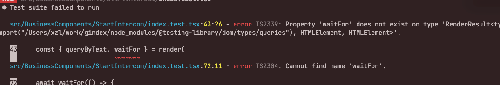

现在版本升级后，waitFor和firstEvent都可以直接从@testing-library/react引入，不会从render函数导出。

7. 选取其中一个单元测试检查是否能够通过，出现axios.create报错，报错信息如下

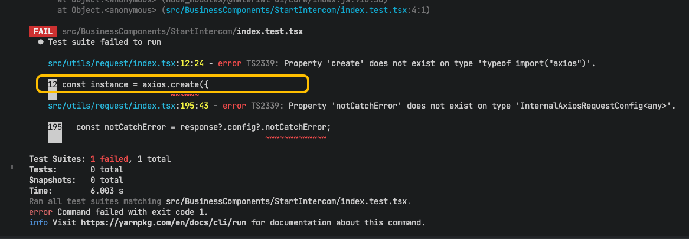

axios版本>0.5.0之后都是支持axios.create方法的，检查后发现，在项目根目录有一个声明文件axios.d.ts，其中声明了axios.create方法的类型，但是在单元测试中没有引入，导致报错。
解决办法是在单元测试中引入typing.d.ts文件，添加如下代码：

```ts
declare module 'axios' {
  import { AxiosRequestConfig as Config } from 'node_modules/axios';
  export * from 'node_modules/axios';

  export interface AxiosRequestConfig extends Config {
    notCatchError?: boolean;
  }
}
```
将上述配置注释后，create方法报错问题得到了解决，但是notCatchError属性报错问题没有解决。

出现很多关于ts的报错，开始疑惑是否是ts配置上面还有问题，对比ginlab项目，可以通过屏蔽ts来解决这些ts类型检查报错的问题，还可以加速单元测试的运行速度。

屏蔽方式如下：

jest.config.ts

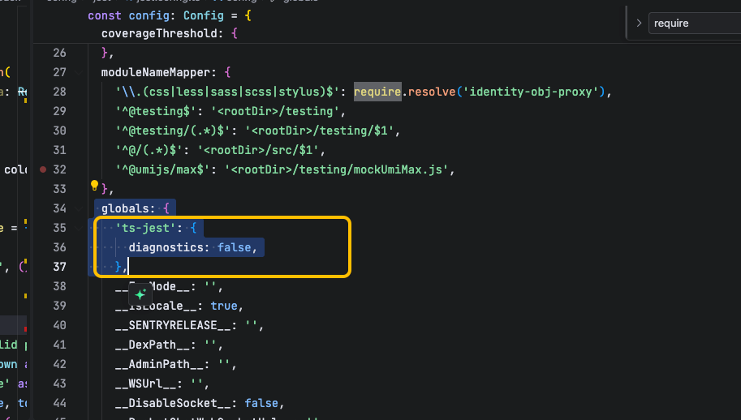

解决了很多ts类型检查报错问题，但是依旧很多其他的单元测无法通过，继续调试。

当前基本上已经处理完了单元测试所需要的环境配置问题，目前只需要根据单个单元测试修正单元测试即可。

