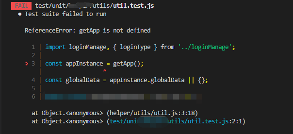

## 小程序全局变量mock（jest单测）

###### *前置条件:在对微信/qq小程序做单元测试时，我们通常需要将一些干扰api或者模块进行mock，以达到我们预期结果。*

### 业务场景

当前有一个util.js文件，用来存放一些工具函数；有时我们需要使用小程序封装的api时，就会出现未定义或者未存在等报错信息。例如：调用`wx.hideLoading()`/`qq.hideLoading()`/`getApp()`,此时会出现类似如下的错误：



> 如果我们需要对这个文件进行测试，我们需要怎么解决这个问题呢？

### 处理方法

配置jest的global对象，将全局变量挂载到global上去

#### 具体步骤

==以qq小程序为例，微信小程序同理==

##### 在你的__test__或者test目录下面创建一个qq.js文件

##### 找到jest.config.js配置文件，修改配置

```js
const path = require('path');

module.exports = {
    rootDir: path.join(__dirname),
    modulePathIgnorePatterns: ['<rootDir>/test/qq.js'], // 必须，添加模块忽略路径
    // ... 其他配置

    moduleNameMapper: { // 配置路径别名，非必须
    '@/(.*)$': '<rootDir>/$1.js'
    },

    setupFiles: ['./test/qq.js'] // 必须，执行文件
}
```

##### /test/qq.js文件里面添加全局变量

```js
// mock getApp() api
global.getApp = function () {
  return {
    // Some variables
  };
};

// mock qq.xxx
global.qq = {
  showLoading: jest.fn(),
  hideLoading: jest.fn(),
  showModal: jest.fn(),
  request: jest.fn(),
  getStorageSync: jest.fn(),
  showShareMenu: jest.fn(),
};

// mock Page
global.Page = ({ data, ...rest }) => {
  const page = {
    data,
    setData: jest.fn(function (newData, cb) {
      this.data = {
        ...this.data,
        ...newData,
      };

      cb && cb();
    }),
    onLoad: jest.fn(),
    onReady: jest.fn(),
    onUnLoad: jest.fn(),
    ...rest,
  };
  global.wxPageInstance = page;
  return page;
};

// 其他的mock值可自行删减
```

###### 此时，再执行npm run test:unit 不会再出现上图的错误信息。问题得到解决。


